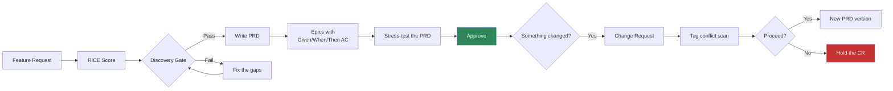
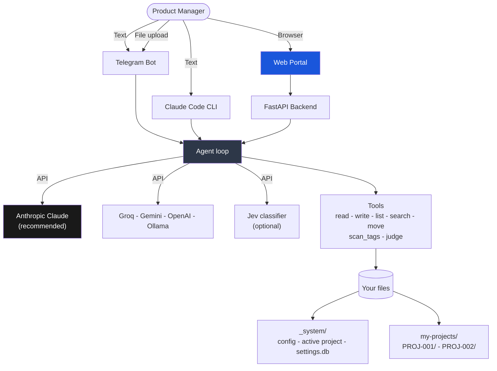

<p align="center">
  <strong>Product Management Skill Jev</strong>
</p>

<p align="center">
  A product management co-pilot that writes the documents, keeps the process honest,<br/>
  and leaves every decision to you. Plain language in, plain markdown out.
</p>

<p align="center">
  <a href="https://www.anthropic.com/"></a>
  <a href="https://www.python.org/"></a>
  <a href="https://nextjs.org/"></a>
  <a href="https://www.docker.com/"></a>
  <a href="https://telegram.org/"></a>
  
  
</p>

<p align="center">
  🌐 English (you are here) ·
  <a href="_readmes/README.vi.md">🇻🇳 Tiếng Việt</a> ·
  <a href="_readmes/README.zh-CN.md">🇨🇳 中文</a> ·
  <a href="_readmes/README.fr.md">🇫🇷 Français</a> ·
  <a href="_readmes/README.ja.md">🇯🇵 日本語</a> ·
  <a href="_readmes/README.es.md">🇪🇸 Español</a>
</p>

---

## Hello

Most of a product manager's week disappears into paperwork. Writing the PRD nobody reads
until sprint planning. Re-deriving a RICE score because the spreadsheet is three laptops
away. Finding out on Thursday that two teams have been rebuilding the same endpoint.

This project takes that work off your hands without taking the decisions with it. You
describe what you need in ordinary sentences. It interviews you where it needs facts,
drafts the document, and shows you the draft. Nothing reaches a file until you say yes.

Everything it produces is plain markdown in a folder you own. No database you cannot
read, no export button, no lock-in. If you delete this tool tomorrow, your PRDs are still
sitting there, readable in any text editor.

**What it is not.** It will not talk to your customers and it will not tell you what to
build. It writes well and it forgets nothing, which is a different skill from judgment.
The judgment stays yours, and the whole system is built to keep it that way.

---

## The idea in one minute

```
You type  ->  It asks what it needs  ->  It shows a draft  ->  You confirm  ->  It writes the file
```

Three rules hold the whole thing together.

1. **It drafts, you decide.** No file is created or changed without you seeing the
   content first and saying yes.
2. **Approved means frozen.** Once a PRD is signed off it never changes. A change means a
   new version, linked to the change request that caused it.
3. **Nothing goes missing quietly.** Every version, decision and piece of stakeholder
   feedback is written down and linked to the rest.

---

## A first conversation

This is what using it actually looks like.

```
You   Create a new project for the checkout redesign

Jev   Before I create it, four quick things:
      product, priority (P0 to P3), target end date, and the goal in one sentence.

You   Payments, P1, 30/11/2026, cut checkout abandonment on mobile

Jev   Here is the draft. Say yes and I will create it.

      my-projects/PROJ-002-checkout-redesign/
        PROJECT.md      goal, milestones, linked FRs and PRDs
        VERSIONS.md     the document registry
        discovery/ prd/ epics/ cr/ stakeholders/ decisions/ sprints/

You   yes

Jev   Created. PROJ-002 is now your active project.
      Next: "Create a feature request for [what you want to build]"

You   Create a feature request for one-tap Apple Pay

Jev   Two questions. Who is asking for this, and what problem does it solve?

You   Mobile users. We lose them at the card form.

Jev   Draft of FR-004. Read it and tell me to save.
      ... problem, users, requested solution ...

You   save it

Jev   Saved to discovery/inbox/FR-004-one-tap-apple-pay.md
      Next: "Score FR-004 with RICE"
```

From there the path is: score it, research it, take it through the discovery gate, turn
it into a PRD, split the PRD into epics with Given/When/Then acceptance criteria. Each
step suggests the next one, so you never have to memorise the sequence.

---

## What you end up with

A folder per project, and it is all yours.

```
my-projects/PROJ-002-checkout-redesign/
  PROJECT.md                    goal, milestones, linked documents
  VERSIONS.md                   every document and its status
  roadmap.md
  discovery/
    inbox/       FR-004-one-tap-apple-pay.md
    scoring/     RICE-004-one-tap-apple-pay.md
    research/    RS-004-payment-providers.md
    gate/        approved.md - rejected.md - backlog.md
  prd/
    PRD-004-one-tap-checkout/
      PRD-004-v1.0.md           approved, never edited again
      PRD-004-v1.1.md           the version a change request produced
      CHANGELOG.md
  epics/
    EP-007-apple-pay-sheet/EP-007-v1.0.md
  cr/
    intake/ - assessment/ - approval-board/ - approved/ - rejected/
    cr-log.md
  stakeholders/  SH-003-robert-engineering-lead.md
  decisions/ - reviews/ - sprints/
```

Open any of it in Obsidian, VS Code or Notion. Commit it to git and your PRD history
becomes a diff you can actually read.

---

## How the work flows



The gate is the step people skip and later regret. A feature does not become a PRD until
it has a score, research behind it, and a real security analysis when it touches
authentication, personal data, payments or audit logging. That last check is not
advisory. It blocks.

---

## Getting started

### 1. Clone it

```bash
git clone https://github.com/taman-spirit/product-skill-jev.git my-pm-workspace
cd my-pm-workspace
cp .env.example .env
```

Open `.env` and set one key to begin with.

```env
ANTHROPIC_API_KEY=sk-ant-your_key_here
```

### 2. Pick what to run

```bash
bash setup.sh
```

```
What would you like to install?

  1) Telegram bot only
  2) Web portal only
  3) Web portal + Telegram bot  <- recommended

Enter option [1/2/3]:
```

An example project is copied into `my-projects/` on first install, so you have real
documents to poke at before writing your own.

### 3. Say hello

Open Telegram and send `/start`, or open the web portal and type into the chat. Try
`Show all projects` first. It costs almost nothing and shows you the shape of things.

---

## Three ways to talk to it

| Surface | Good for | Start with |
|---------|----------|------------|
| **Telegram bot** | Catching an idea on your phone, a status check between meetings | `make start`, then `/start` |
| **Web portal** | Real work. Chat on the left, the document being written on the right | `cd apps && make start` |
| **Claude Code** | Working inside the repository, where the skills load themselves | open the folder |

### The web portal

```
+---------------------------------+----------------------------+
|  Chat                           |  File viewer               |
|                                 |                            |
|  You: Create a feature request  |  FR-004-apple-pay.md       |
|       for one-tap Apple Pay     |  -----------------         |
|                                 |  ---                       |
|  Jev: Two questions...          |  fr-id: FR-004             |
|                                 |  status: draft             |
|  [write_file] --------------->  |  [Refresh]                 |
+---------------------------------+----------------------------+
```

Four screens. **Chat** with the live file view, **Projects** for browsing and editing
documents, **Settings** for API keys, and **Audit Log** for the timeline of every change.

---

## Under the hood



The agent has seven tools and no others. Five read and write files. `scan_tags` works out
which PRDs share a module, deterministically, in plain Python. `judge` asks the optional
Jev classifier for a typed opinion. Everything the agent knows how to do is written in
`AGENT.md` and the skills below, in English you can read and change.

### Skills

Every skill is a folder under `.claude/skills/` holding one `SKILL.md`. Claude Code finds
them from their descriptions. The bot and the web backend look them up through the index
in `AGENT.md`.

| Area | Skills |
|------|--------|
| Discovery | create-fr, score-feature, gate-review, deep-research |
| PRD | to-prd, manage-epic, conflict-check, grill-prd, update-prd |
| Project | create-project, find-project, project-status |
| Change requests | intake-cr, assess-cr, approve-cr |
| Stakeholders | add-stakeholder, draft-comms |
| Platform | setup-workspace, new-sprint, version-doc, product-skill-jev |

Twenty-one of them. Open one and read it. They are instructions, not code, and editing
one changes how the system behaves.

---

## The rules it keeps

**It shows you the draft.** Every skill ends the same way: here is what I would write,
say yes. That is not politeness, it is the design.

**Approved documents do not change.** A signed-off PRD is frozen. Want something
different? Raise a change request. Approving it creates v1.1 or v2.0 with the reason
attached.

**Stakeholders are remembered.** Describe a person once and you get a profile. Tell it
what they said and it files the feedback, scans your documents, and shows you what might
need updating before touching anything.

**Conflicts are found by code, not by guesswork.** A Python scan reads every PRD and
returns every pair sharing a module tag. A PRD with no tags is reported as "not
checkable", which is not the same as "no conflicts". Only then is a model asked whether a
shared tag is a real collision.

**You can switch AI providers.** Save several keys, activate one with a click. Claude is
recommended for document quality. Groq's free tier is fine for trying things out.

---

## Choosing a model

Claude writes the best PRDs, epics and stakeholder emails of the options here. Get a key
at **https://console.anthropic.com/settings/keys**.

| Model | Per 1M tokens | Good for |
|-------|---------------|----------|
| `claude-sonnet-4-6` | $3 / $15 | Daily work. Start here |
| `claude-opus-4-7` | $5 / $25 | Long PRDs, tangled analysis |
| `claude-haiku-4-5` | $1 / $5 | Quick lookups |

Other providers work too.

| Provider | Setup | Cost | Notes |
|----------|-------|------|-------|
| **Anthropic Claude** | `AI_PROVIDER=anthropic` | $1 to $25 / 1M | Recommended |
| Groq | `AI_PROVIDER=openai` plus the Groq URL | Free tier | Good for testing |
| Google Gemini | `AI_PROVIDER=google` | Free tier | 15 requests a minute |
| OpenAI | `AI_PROVIDER=openai` | $0.15 to $10 / 1M | GPT-4o or mini |
| Ollama | `AI_PROVIDER=openai` plus localhost | Free | Needs a local GPU |

---

## Jev, the fast classifier (optional)

Jev is a System One model from TypeSafe AI. It does not write prose. You give it text and
typed questions, and it returns labels with calibrated probabilities in roughly 70 to 500
milliseconds. It runs alongside your main provider, never instead of it, and the whole
integration sits idle unless you give it a key.

Three things run in Python, before the agent sees your input.

- **Stakeholder feedback** is classified by type and urgency, so the `Sentiment` field in
  a feedback log is suggested rather than guessed.
- **Command routing** stops depending on English keywords when the main provider errors
  or hits a rate limit.
- **Uploaded files** get a suggested destination folder instead of a question.

Five more run through the `judge` tool, because only the agent holds the file contents.

| Question set | Where | What it adds |
|--------------|-------|--------------|
| `fr_triage` | create-fr | Spots an idea that is really a change request, or touches security |
| `gate_review` | gate-review | Blocks the gate when the Security section is a heading with nothing under it |
| `rice_bands` | score-feature | Suggests bands inside the interview, never fills a value |
| `cr_assessment` | assess-cr | Scope delta, and whether the PRD needs v2.0 or v1.1 |
| `conflict_pair` | conflict scan | Ranks the pairs `scan_tags` found. It never finds one itself |

Jev never writes a file. When the key is missing, the request times out, or confidence
falls below the threshold, every path falls back to what the system did before Jev
existed.

```
TYPESAFE_API_KEY=            # leave empty to run without Jev
TYPESAFE_DEFAULT_MODEL=jev-latest
# TYPESAFE_BASE_URL=         # defaults to https://api.typesafe.ai
# TYPESAFE_TIMEOUT=3.0
```

Every question and every default threshold lives in `bot/jev.py`, next to the
measurements they were taken against. The portal's Settings page can set the key, switch
Jev off, and override any threshold. Overrides layer on top of the defaults, the page
shows which values deviate, and one button restores the measured set. Editing a threshold
does not re-run the measurement behind it, which is why the page says so first.

Full guidance is in `.claude/skills/product-skill-jev`.

---

## Everyday commands

```bash
# Telegram bot, from the repository root
make start      # start it
make stop       # stop it
make restart    # restart
make update     # rebuild the image and restart
make logs       # follow the logs
make status     # health check

# Web portal, from apps/
cd apps
make start
make stop
make logs
make build      # rebuild after changing code
```

---

## Tests

```bash
# everything (170 tests)
cd apps/backend && python3 -m pytest ../../tests/ -v

# by area
python3 -m pytest tests/test_installation.py   # 35
python3 -m pytest tests/test_agent_tools.py    # 26
python3 -m pytest tests/test_backend_api.py    # 26
python3 -m pytest tests/test_jev.py            # 61
python3 -m pytest tests/test_tags.py           # 22
```

Some tests import `bot/bot.py`, which needs Python 3.10 or newer. They skip themselves on
an older interpreter. On 3.12 in Docker the whole suite runs.

---

## Questions people ask

**Do I need to be technical?** No. You type sentences. It handles folders, IDs, templates
and cross-links.

**Where does my data live?** Markdown files in your own folder. Nothing is stored
anywhere else.

**Can a team share one workspace?** Yes. Share the folder through git or a shared drive.
Git is better, because then your document history is real history.

**Can I edit the files by hand?** Please do. It is markdown. Just remember that approved
documents are meant to be frozen, and the system will remind you if you forget.

**What if it stops answering?** Open Settings and check that a key is saved and the
active provider shows green.

**Does it need Jev?** No. Leave `TYPESAFE_API_KEY` empty and everything works the way it
did before Jev was added.

---

## Reading that shaped this

| Area | Source |
|------|--------|
| Skill format | [mattpocock/skills](https://github.com/mattpocock/skills) |
| Feature scoring | [RICE Scoring](https://www.intercom.com/blog/rice-simple-prioritization-for-product-managers/), Intercom |
| Product discovery | [Continuous Discovery Habits](https://www.producttalk.org/), Teresa Torres |
| PRD standards | [Inspired](https://www.svpg.com/books/inspired-how-to-create-tech-products-customers-love-2nd-edition/), Marty Cagan |
| User stories | [Writing Good User Stories](https://www.mountaingoatsoftware.com/agile/user-stories), Mike Cohn |
| Decision records | [Architectural Decision Records](https://adr.github.io/) |

---

## Translations

English is the source of truth and is updated first. The other languages live in
[`_readmes/`](_readmes/) and may lag behind by a release or two. If you spot a gap, a pull
request is very welcome.

---

CC BY-NC 4.0 - [Creative Commons Attribution-NonCommercial 4.0](https://creativecommons.org/licenses/by-nc/4.0/)
