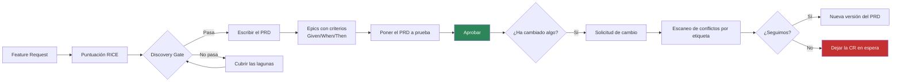
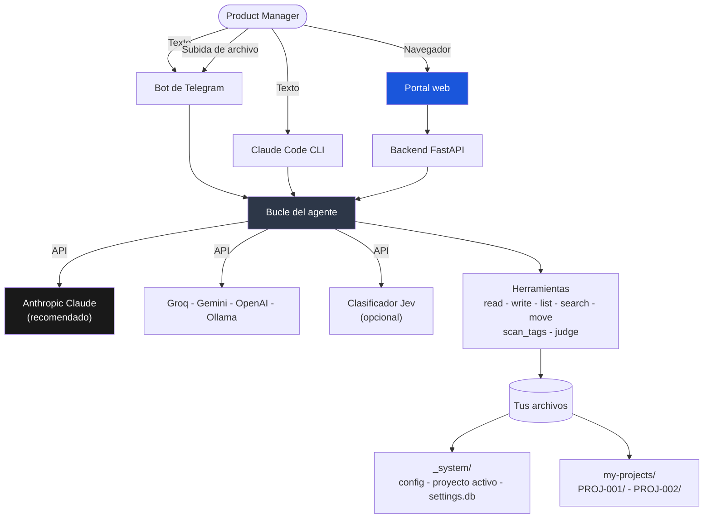

[🇺🇸 English](../README.md)

<p align="center">
  <strong>Product Management Skill Jev</strong>
</p>

<p align="center">
  Un copiloto de gestión de producto que escribe los documentos, mantiene el proceso honesto<br/>
  y te deja a ti cada decisión. Entra lenguaje corriente, sale markdown puro.
</p>

<p align="center">
  <a href="https://www.anthropic.com/"></a>
  <a href="https://www.python.org/"></a>
  <a href="https://nextjs.org/"></a>
  <a href="https://www.docker.com/"></a>
  <a href="https://telegram.org/"></a>
  
  
</p>

<p align="center">
  🌐 <a href="../README.md">🇺🇸 English</a> ·
  <a href="README.vi.md">🇻🇳 Tiếng Việt</a> ·
  <a href="README.zh-CN.md">🇨🇳 中文</a> ·
  <a href="README.fr.md">🇫🇷 Français</a> ·
  <a href="README.ja.md">🇯🇵 日本語</a> ·
  🇪🇸 Español (estás aquí)
</p>

> Esta traducción puede ir algunas versiones por detrás de [la versión en inglés](../README.md), que es la de referencia.

---

## Hola

La mayor parte de la semana de un product manager se va en papeleo. Escribir el PRD que
nadie abre hasta la sprint planning. Recalcular una puntuación RICE porque la hoja de
cálculo se quedó en otro portátil. Descubrir el jueves que dos equipos llevan días
reconstruyendo el mismo endpoint.

Este proyecto se lleva ese trabajo sin llevarse las decisiones de paso. Describes lo que
necesitas en frases normales. Te pregunta lo que le falta, redacta el documento y te enseña
el borrador. Nada llega a un archivo hasta que dices que sí.

Todo lo que produce es markdown puro, en una carpeta que es tuya. Sin bases de datos
ilegibles, sin botón de exportar, sin quedarte atrapado. Si mañana borras esta herramienta,
tus PRD siguen ahí, abribles con cualquier editor de texto.

**Lo que no es.** No hablará con tus clientes ni te dirá qué construir. Escribe bien y no
olvida nada, que es una habilidad distinta del criterio. El criterio sigue siendo tuyo, y
todo el sistema está construido para que siga así.

---

## La idea en un minuto

```
Escribes  ->  Pregunta lo que necesita  ->  Enseña un borrador  ->  Confirmas  ->  Escribe el archivo
```

Tres reglas sostienen todo el conjunto.

1. **Él redacta, tú decides.** Ningún archivo se crea ni se cambia sin que hayas visto el
   contenido y hayas dicho que sí.
2. **Aprobado significa congelado.** Un PRD firmado ya no cambia. Un cambio produce una
   versión nueva, ligada a la solicitud de cambio que lo provocó.
3. **Nada desaparece en silencio.** Cada versión, cada decisión y cada comentario de una
   parte interesada queda registrado y enlazado con el resto.

---

## Una primera conversación

Así es usarlo de verdad.

```
Tú    Crea un proyecto nuevo para el rediseño del checkout

Jev   Antes de crearlo, cuatro cosas rápidas:
      producto, prioridad (P0 a P3), fecha objetivo de fin y el objetivo en una frase.

Tú    Payments, P1, 30/11/2026, reducir el abandono del checkout en móvil

Jev   Este es el borrador. Di que sí y lo creo.

      my-projects/PROJ-002-checkout-redesign/
        PROJECT.md      objetivo, hitos, FR y PRD enlazados
        VERSIONS.md     el registro de documentos
        discovery/ prd/ epics/ cr/ stakeholders/ decisions/ sprints/

Tú    sí

Jev   Creado. PROJ-002 es ahora tu proyecto activo.
      Siguiente: "Crea una feature request para [lo que quieras construir]"

Tú    Crea una feature request para Apple Pay en un toque

Jev   Dos preguntas. ¿Quién lo pide y qué problema resuelve?

Tú    Los usuarios de móvil. Los perdemos en el formulario de la tarjeta.

Jev   Borrador de FR-004. Léelo y dime que lo guarde.
      ... problema, usuarios, solución solicitada ...

Tú    guárdalo

Jev   Guardado en discovery/inbox/FR-004-one-tap-apple-pay.md
      Siguiente: "Puntúa FR-004 con RICE"
```

A partir de ahí el camino es: puntuarlo, investigarlo, pasarlo por el Discovery Gate,
convertirlo en PRD y dividir el PRD en epics con criterios de aceptación
Given/When/Then. Cada paso sugiere el siguiente, así que no tienes que memorizar el orden.

---

## Con qué te quedas

Una carpeta por proyecto, y es toda tuya.

```
my-projects/PROJ-002-checkout-redesign/
  PROJECT.md                    objetivo, hitos, documentos enlazados
  VERSIONS.md                   cada documento y su estado
  roadmap.md
  discovery/
    inbox/       FR-004-one-tap-apple-pay.md
    scoring/     RICE-004-one-tap-apple-pay.md
    research/    RS-004-payment-providers.md
    gate/        approved.md - rejected.md - backlog.md
  prd/
    PRD-004-one-tap-checkout/
      PRD-004-v1.0.md           aprobado, nunca se vuelve a editar
      PRD-004-v1.1.md           la versión que produjo una solicitud de cambio
      CHANGELOG.md
  epics/
    EP-007-apple-pay-sheet/EP-007-v1.0.md
  cr/
    intake/ - assessment/ - approval-board/ - approved/ - rejected/
    cr-log.md
  stakeholders/  SH-003-robert-engineering-lead.md
  decisions/ - reviews/ - sprints/
```

Abre lo que quieras en Obsidian, VS Code o Notion. Súbelo a git y el historial de tus PRD se
convierte en un diff que de verdad se puede leer.

---

## Cómo fluye el trabajo



El gate es el paso que la gente se salta y luego lamenta. Una funcionalidad no se convierte
en PRD hasta que tiene una puntuación, investigación detrás y un análisis de seguridad real
cuando toca autenticación, datos personales, pagos o registros de auditoría. Esa última
comprobación no es un consejo. Bloquea.

---

## Primeros pasos

### 1. Clonar

```bash
git clone https://github.com/taman-spirit/product-skill-jev.git my-pm-workspace
cd my-pm-workspace
cp .env.example .env
```

Abre `.env` y pon una clave para empezar.

```env
ANTHROPIC_API_KEY=sk-ant-your_key_here
```

### 2. Elegir qué instalar

```bash
bash setup.sh
```

```
What would you like to install?

  1) Telegram bot only
  2) Web portal only
  3) Web portal + Telegram bot  <- recommended

Enter option [1/2/3]:
```

En la primera instalación se copia un proyecto de ejemplo en `my-projects/`, de modo que
tengas documentos reales que curiosear antes de escribir los tuyos.

### 3. Saludar

Abre Telegram y envía `/start`, o abre el portal web y escribe en el chat. Empieza por
`Show all projects`. Casi no cuesta nada y te enseña la forma del conjunto.

---

## Tres formas de hablar con él

| Interfaz | Buena para | Empieza con |
|----------|-----------|-------------|
| **Bot de Telegram** | Cazar una idea en el móvil, una consulta rápida entre reuniones | `make start` y luego `/start` |
| **Portal web** | Trabajo de verdad. El chat a la izquierda, el documento a la derecha | `cd apps && make start` |
| **Claude Code** | Trabajar dentro del repositorio, donde las skills se cargan solas | abrir la carpeta |

### El portal web

```
+---------------------------------+----------------------------+
|  Chat                           |  File viewer               |
|                                 |                            |
|  You: Create a feature request  |  FR-004-apple-pay.md       |
|       for one-tap Apple Pay     |  -----------------         |
|                                 |  ---                       |
|  Jev: Two questions...          |  fr-id: FR-004             |
|                                 |  status: draft             |
|  [write_file] --------------->  |  [Refresh]                 |
+---------------------------------+----------------------------+
```

Cuatro pantallas. **Chat** con la vista de archivo en vivo, **Projects** para explorar y
editar documentos, **Settings** para las claves de API y **Audit Log** para la cronología de
cada cambio. La interfaz web está en inglés.

---

## Por dentro



El agente tiene siete herramientas y ninguna más. Cinco leen y escriben archivos.
`scan_tags` averigua qué PRD comparten módulo, de forma determinista, en Python puro.
`judge` le pide una opinión tipada al clasificador Jev, que es opcional. Todo lo que el
agente sabe hacer está escrito en `AGENT.md` y en las skills de abajo, en un inglés que
puedes leer y cambiar.

### Skills

Cada skill es una carpeta dentro de `.claude/skills/` con un único `SKILL.md`. Claude Code
las encuentra por su descripción. El bot y el backend web las consultan mediante el índice
de `AGENT.md`.

| Área | Skills |
|------|--------|
| Discovery | create-fr, score-feature, gate-review, deep-research |
| PRD | to-prd, manage-epic, conflict-check, grill-prd, update-prd |
| Proyecto | create-project, find-project, project-status |
| Solicitudes de cambio | intake-cr, assess-cr, approve-cr |
| Partes interesadas | add-stakeholder, draft-comms |
| Plataforma | setup-workspace, new-sprint, version-doc, product-skill-jev |

Veintiuna en total. Abre una y léela. Son instrucciones, no código, y editar una cambia cómo
se comporta el sistema.

---

## Las reglas que mantiene

**Te enseña el borrador.** Todas las skills terminan igual: esto es lo que escribiría, ¿te
parece? No es cortesía, es el diseño.

**Los documentos aprobados no cambian.** Un PRD firmado queda congelado. ¿Quieres algo
distinto? Abre una solicitud de cambio. Aprobarla crea una v1.1 o una v2.0 con el motivo
adjunto.

**Las partes interesadas se recuerdan.** Describe a una persona una vez y tendrás su perfil.
Cuéntale lo que dijo y archiva el comentario, revisa tus documentos y te enseña qué podría
necesitar actualización, antes de tocar nada.

**Los conflictos los encuentra el código, no la intuición.** Un escaneo en Python lee todos
los PRD y devuelve todos los pares que comparten una etiqueta de módulo. Un PRD sin
etiquetas se informa como "no comprobable", que no es lo mismo que "sin conflictos". Solo
después se le pregunta a un modelo si una etiqueta compartida es una colisión real.

**Puedes cambiar de proveedor de IA.** Guarda varias claves y activa una con un clic. Claude
está recomendado por la calidad de los documentos. El plan gratuito de Groq basta para
probar.

---

## Elegir modelo

De las opciones que hay aquí, Claude escribe los mejores PRD, epics y correos a partes
interesadas. Consigue una clave en
**https://console.anthropic.com/settings/keys**.

| Modelo | Por 1M de tokens | Bueno para |
|--------|------------------|-----------|
| `claude-sonnet-4-6` | 3 $ / 15 $ | El día a día. Empieza aquí |
| `claude-opus-4-7` | 5 $ / 25 $ | PRD largos, análisis enredados |
| `claude-haiku-4-5` | 1 $ / 5 $ | Consultas rápidas |

Otros proveedores también funcionan.

| Proveedor | Configuración | Coste | Notas |
|-----------|---------------|-------|-------|
| **Anthropic Claude** | `AI_PROVIDER=anthropic` | 1 $ a 25 $ / 1M | Recomendado |
| Groq | `AI_PROVIDER=openai` más la URL de Groq | Plan gratuito | Bien para probar |
| Google Gemini | `AI_PROVIDER=google` | Plan gratuito | 15 peticiones por minuto |
| OpenAI | `AI_PROVIDER=openai` | 0,15 $ a 10 $ / 1M | GPT-4o o mini |
| Ollama | `AI_PROVIDER=openai` más localhost | Gratis | Necesita GPU local |

---

## Jev, el clasificador rápido (opcional)

Jev es un modelo System One de TypeSafe AI. No escribe prosa. Le das texto y preguntas
tipadas, y devuelve etiquetas con probabilidades calibradas en unos 70 a 500 milisegundos.
Funciona junto a tu proveedor principal, nunca en su lugar, y toda la integración queda
inerte mientras no le des una clave.

Tres cosas ocurren en Python, antes de que el agente vea lo que has escrito.

- **Los comentarios de partes interesadas** se clasifican por tipo y urgencia, de modo que
  el campo `Sentiment` del registro de comentarios es una sugerencia y no una suposición.
- **El enrutado de comandos** deja de depender de palabras clave en inglés cuando el
  proveedor principal falla o alcanza un límite de peticiones.
- **Los archivos subidos** reciben una carpeta de destino sugerida en vez de una pregunta.

Otras cinco pasan por la herramienta `judge`, porque solo el agente tiene el contenido de
los archivos.

| Conjunto de preguntas | Dónde | Qué aporta |
|----------------------|-------|------------|
| `fr_triage` | create-fr | Detecta la idea que en realidad es una solicitud de cambio, o que toca seguridad |
| `gate_review` | gate-review | Bloquea el gate cuando la sección de Seguridad es un titular sin nada debajo |
| `rice_bands` | score-feature | Sugiere rangos dentro de la entrevista, nunca rellena un valor |
| `cr_assessment` | assess-cr | El salto de alcance, y si el PRD necesita v2.0 o v1.1 |
| `conflict_pair` | escaneo de conflictos | Ordena los pares que encontró `scan_tags`. Él nunca encuentra ninguno |

Jev nunca escribe un archivo. Si falta la clave, si la petición expira o si la confianza cae
por debajo del umbral, todos los caminos vuelven a lo que el sistema hacía antes de que Jev
existiera.

```
TYPESAFE_API_KEY=            # déjalo vacío para funcionar sin Jev
TYPESAFE_DEFAULT_MODEL=jev-latest
# TYPESAFE_BASE_URL=         # por defecto https://api.typesafe.ai
# TYPESAFE_TIMEOUT=3.0
```

Cada pregunta y cada umbral por defecto vive en `bot/jev.py`, junto a las mediciones que los
justifican. La página Settings del portal permite fijar la clave, apagar Jev y sobrescribir
cualquier umbral. Los valores propios se superponen a los predeterminados, la página señala
cuáles se desvían y un botón restaura el conjunto medido. Cambiar un umbral no vuelve a
ejecutar la medición que lo respalda, y por eso la página lo advierte antes.

La guía completa está en `.claude/skills/product-skill-jev`.

---

## Comandos del día a día

```bash
# Bot de Telegram, desde la raíz del repositorio
make start      # arrancar
make stop       # parar
make restart    # reiniciar
make update     # reconstruir la imagen y reiniciar
make logs       # seguir los registros
make status     # comprobar el estado

# Portal web, desde apps/
cd apps
make start
make stop
make logs
make build      # reconstruir tras cambiar el código
```

---

## Tests

```bash
# todo (170 tests)
cd apps/backend && python3 -m pytest ../../tests/ -v

# por área
python3 -m pytest tests/test_installation.py   # 35
python3 -m pytest tests/test_agent_tools.py    # 26
python3 -m pytest tests/test_backend_api.py    # 26
python3 -m pytest tests/test_jev.py            # 61
python3 -m pytest tests/test_tags.py           # 22
```

Algunos tests importan `bot/bot.py`, que necesita Python 3.10 o superior. Se saltan solos en
un intérprete más antiguo. En 3.12 dentro de Docker se ejecuta la suite entera.

---

## Preguntas que suele hacer la gente

**¿Hace falta ser técnico?** No. Tú escribes frases. Él se encarga de carpetas,
identificadores, plantillas y enlaces cruzados.

**¿Dónde viven mis datos?** En archivos markdown, en tu propia carpeta. No se guarda nada en
ningún otro sitio.

**¿Puede un equipo compartir un espacio de trabajo?** Sí. Comparte la carpeta por git o por
una unidad compartida. Git es mejor, porque así el historial de documentos es historial de
verdad.

**¿Puedo editar los archivos a mano?** Adelante, es markdown. Solo recuerda que los
documentos aprobados están pensados para quedarse congelados, y el sistema te lo recordará.

**¿Y si deja de responder?** Abre Settings y comprueba que hay una clave guardada y que el
proveedor activo muestra el indicador en verde.

**¿Necesita Jev?** No. Deja `TYPESAFE_API_KEY` vacío y todo funciona como antes de añadirlo.

---

## Lecturas que dieron forma a esto

| Área | Fuente |
|------|--------|
| Formato de las skills | [mattpocock/skills](https://github.com/mattpocock/skills) |
| Puntuación de funcionalidades | [RICE Scoring](https://www.intercom.com/blog/rice-simple-prioritization-for-product-managers/), Intercom |
| Product discovery | [Continuous Discovery Habits](https://www.producttalk.org/), Teresa Torres |
| Estándares de PRD | [Inspired](https://www.svpg.com/books/inspired-how-to-create-tech-products-customers-love-2nd-edition/), Marty Cagan |
| Historias de usuario | [Writing Good User Stories](https://www.mountaingoatsoftware.com/agile/user-stories), Mike Cohn |
| Registro de decisiones | [Architectural Decision Records](https://adr.github.io/) |

---

CC BY-NC 4.0 - [Creative Commons Attribution-NonCommercial 4.0](https://creativecommons.org/licenses/by-nc/4.0/)
