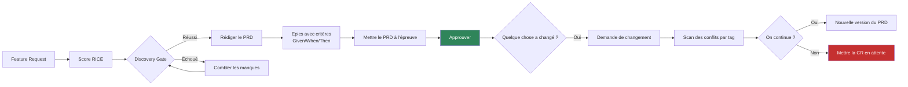
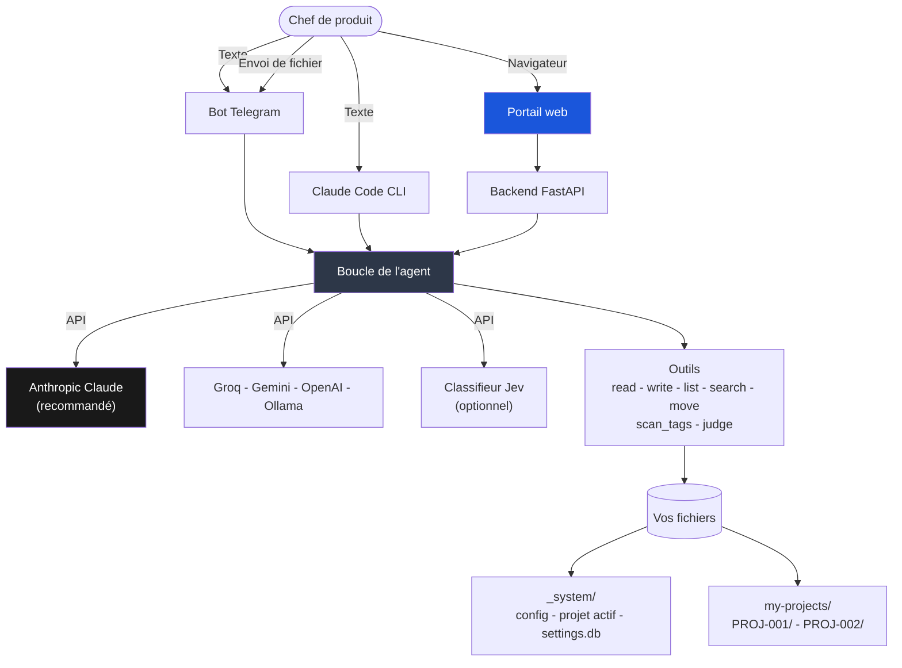

[🇺🇸 English](../README.md)

<p align="center">
  <strong>Product Management Skill Jev</strong>
</p>

<p align="center">
  Un copilote de gestion de produit qui rédige les documents, tient le processus au sérieux,<br/>
  et vous laisse chaque décision. Du langage courant en entrée, du markdown brut en sortie.
</p>

<p align="center">
  <a href="https://www.anthropic.com/"></a>
  <a href="https://www.python.org/"></a>
  <a href="https://nextjs.org/"></a>
  <a href="https://www.docker.com/"></a>
  <a href="https://telegram.org/"></a>
  
  
</p>

<p align="center">
  🌐 <a href="../README.md">🇺🇸 English</a> ·
  <a href="README.vi.md">🇻🇳 Tiếng Việt</a> ·
  <a href="README.zh-CN.md">🇨🇳 中文</a> ·
  🇫🇷 Français (vous êtes ici) ·
  <a href="README.ja.md">🇯🇵 日本語</a> ·
  <a href="README.es.md">🇪🇸 Español</a>
</p>

> Cette traduction peut avoir quelques versions de retard sur [la version anglaise](../README.md), qui fait foi.

---

## Bonjour

L'essentiel de la semaine d'un chef de produit disparaît dans la paperasse. Rédiger le PRD
que personne ne lira avant le sprint planning. Recalculer un score RICE parce que le tableur
est resté sur un autre portable. Découvrir le jeudi que deux équipes reconstruisent le même
endpoint.

Ce projet vous enlève ce travail sans vous enlever les décisions au passage. Vous décrivez
votre besoin en phrases ordinaires. Il vous interroge là où il lui manque des faits, rédige
le document, puis vous montre le brouillon. Rien n'atteint un fichier tant que vous n'avez
pas dit oui.

Tout ce qu'il produit est du markdown brut, dans un dossier qui vous appartient. Pas de base
de données illisible, pas de bouton d'export, pas d'enfermement. Supprimez cet outil demain
et vos PRD seront toujours là, lisibles dans n'importe quel éditeur de texte.

**Ce qu'il n'est pas.** Il ne parlera pas à vos clients à votre place et il ne vous dira pas
quoi construire. Il écrit bien et n'oublie rien, ce qui est une compétence différente du
jugement. Le jugement reste le vôtre, et tout le système est conçu pour qu'il en soit ainsi.

---

## L'idée en une minute

```
Vous écrivez  ->  Il demande ce qu'il lui faut  ->  Il montre un brouillon  ->  Vous confirmez  ->  Il écrit le fichier
```

Trois règles tiennent l'ensemble debout.

1. **Il rédige, vous décidez.** Aucun fichier n'est créé ni modifié sans que vous ayez vu le
   contenu et donné votre accord.
2. **Approuvé veut dire gelé.** Une fois un PRD validé, il ne change plus. Un changement
   donne une nouvelle version, liée à la demande de changement qui l'a provoquée.
3. **Rien ne disparaît en silence.** Chaque version, chaque décision et chaque retour de
   partie prenante est consigné et relié au reste.

---

## Une première conversation

Voilà à quoi ressemble l'usage réel.

```
Vous  Crée un nouveau projet pour la refonte du tunnel de paiement

Jev   Avant de créer, quatre choses rapides :
      produit, priorité (P0 à P3), date de fin visée, et l'objectif en une phrase.

Vous  Payments, P1, 30/11/2026, réduire l'abandon du paiement sur mobile

Jev   Voici le brouillon. Dites oui et je crée.

      my-projects/PROJ-002-checkout-redesign/
        PROJECT.md      objectif, jalons, FR et PRD liés
        VERSIONS.md     le registre des documents
        discovery/ prd/ epics/ cr/ stakeholders/ decisions/ sprints/

Vous  oui

Jev   Créé. PROJ-002 est maintenant votre projet actif.
      Ensuite : "Crée une feature request pour [ce que vous voulez construire]"

Vous  Crée une feature request pour Apple Pay en un geste

Jev   Deux questions. Qui le demande, et quel problème cela résout-il ?

Vous  Les utilisateurs mobiles. On les perd au formulaire de carte.

Jev   Brouillon de FR-004. Lisez-le et dites-moi d'enregistrer.
      ... problème, utilisateurs, solution demandée ...

Vous  enregistre

Jev   Enregistré dans discovery/inbox/FR-004-one-tap-apple-pay.md
      Ensuite : "Note FR-004 avec RICE"
```

Le chemin continue ainsi : noter, rechercher, passer le Discovery Gate, transformer en PRD,
découper le PRD en epics avec des critères d'acceptation Given/When/Then. Chaque étape
suggère la suivante, vous n'avez donc pas à retenir l'ordre.

---

## Ce que vous obtenez

Un dossier par projet, et il est entièrement à vous.

```
my-projects/PROJ-002-checkout-redesign/
  PROJECT.md                    objectif, jalons, documents liés
  VERSIONS.md                   chaque document et son statut
  roadmap.md
  discovery/
    inbox/       FR-004-one-tap-apple-pay.md
    scoring/     RICE-004-one-tap-apple-pay.md
    research/    RS-004-payment-providers.md
    gate/        approved.md - rejected.md - backlog.md
  prd/
    PRD-004-one-tap-checkout/
      PRD-004-v1.0.md           approuvé, plus jamais modifié
      PRD-004-v1.1.md           la version produite par une demande de changement
      CHANGELOG.md
  epics/
    EP-007-apple-pay-sheet/EP-007-v1.0.md
  cr/
    intake/ - assessment/ - approval-board/ - approved/ - rejected/
    cr-log.md
  stakeholders/  SH-003-robert-engineering-lead.md
  decisions/ - reviews/ - sprints/
```

Ouvrez tout cela dans Obsidian, VS Code ou Notion. Versionnez-le dans git et l'historique de
vos PRD devient un diff réellement lisible.

---

## Comment le travail circule



Le gate est l'étape que l'on saute et que l'on regrette ensuite. Une fonctionnalité ne
devient pas un PRD tant qu'elle n'a pas un score, une recherche derrière elle, et une
véritable analyse de sécurité dès qu'elle touche à l'authentification, aux données
personnelles, aux paiements ou aux journaux d'audit. Cette dernière vérification n'est pas
un conseil. Elle bloque.

---

## Pour commencer

### 1. Cloner

```bash
git clone https://github.com/taman-spirit/product-skill-jev.git my-pm-workspace
cd my-pm-workspace
cp .env.example .env
```

Ouvrez `.env` et renseignez une clé pour démarrer.

```env
ANTHROPIC_API_KEY=sk-ant-your_key_here
```

### 2. Choisir ce que vous installez

```bash
bash setup.sh
```

```
What would you like to install?

  1) Telegram bot only
  2) Web portal only
  3) Web portal + Telegram bot  <- recommended

Enter option [1/2/3]:
```

Un projet d'exemple est copié dans `my-projects/` à la première installation, ce qui vous
donne de vrais documents à explorer avant d'écrire les vôtres.

### 3. Dire bonjour

Ouvrez Telegram et envoyez `/start`, ou ouvrez le portail web et écrivez dans le chat.
Commencez par `Show all projects`. Cela ne coûte presque rien et vous montre la forme de
l'ensemble.

---

## Trois façons de lui parler

| Interface | Utile pour | Commencer par |
|-----------|-----------|---------------|
| **Bot Telegram** | Attraper une idée sur votre téléphone, un point rapide entre deux réunions | `make start`, puis `/start` |
| **Portail web** | Le vrai travail. Le chat à gauche, le document en cours à droite | `cd apps && make start` |
| **Claude Code** | Travailler dans le dépôt lui-même, où les skills se chargent seuls | ouvrir le dossier |

### Le portail web

```
+---------------------------------+----------------------------+
|  Chat                           |  File viewer               |
|                                 |                            |
|  You: Create a feature request  |  FR-004-apple-pay.md       |
|       for one-tap Apple Pay     |  -----------------         |
|                                 |  ---                       |
|  Jev: Two questions...          |  fr-id: FR-004             |
|                                 |  status: draft             |
|  [write_file] --------------->  |  [Refresh]                 |
+---------------------------------+----------------------------+
```

Quatre écrans. **Chat** avec la vue fichier en direct, **Projects** pour parcourir et éditer
les documents, **Settings** pour les clés API, et **Audit Log** pour la chronologie de
chaque changement. L'interface web est en anglais.

---

## Sous le capot



L'agent dispose de sept outils et d'aucun autre. Cinq lisent et écrivent des fichiers.
`scan_tags` détermine quels PRD partagent un module, de façon déterministe, en Python pur.
`judge` demande un avis typé au classifieur Jev, optionnel. Tout ce que l'agent sait faire
est écrit dans `AGENT.md` et dans les skills ci-dessous, en anglais que vous pouvez lire et
modifier.

### Les skills

Chaque skill est un dossier sous `.claude/skills/` contenant un seul `SKILL.md`. Claude Code
les trouve grâce à leur description. Le bot et le backend web les consultent via l'index
présent dans `AGENT.md`.

| Domaine | Skills |
|---------|--------|
| Discovery | create-fr, score-feature, gate-review, deep-research |
| PRD | to-prd, manage-epic, conflict-check, grill-prd, update-prd |
| Projet | create-project, find-project, project-status |
| Demandes de changement | intake-cr, assess-cr, approve-cr |
| Parties prenantes | add-stakeholder, draft-comms |
| Plateforme | setup-workspace, new-sprint, version-doc, product-skill-jev |

Vingt et un en tout. Ouvrez-en un et lisez-le. Ce sont des instructions, pas du code, et en
modifier un change le comportement du système.

---

## Les règles qu'il tient

**Il vous montre le brouillon.** Chaque skill se termine de la même façon : voici ce que
j'écrirais, d'accord ? Ce n'est pas de la politesse, c'est la conception.

**Les documents approuvés ne changent pas.** Un PRD validé est gelé. Vous voulez autre
chose ? Déposez une demande de changement. L'approuver crée une v1.1 ou une v2.0 avec la
raison attachée.

**Les parties prenantes sont mémorisées.** Décrivez une personne une fois et vous obtenez
son profil. Dites-lui ce qu'elle a dit et il classe le retour, parcourt vos documents, puis
vous montre ce qui pourrait devoir être mis à jour, avant de toucher à quoi que ce soit.

**Les conflits sont trouvés par du code, pas à l'intuition.** Un scan Python lit tous les
PRD et renvoie toutes les paires partageant un tag de module. Un PRD sans tag est signalé
comme « non vérifiable », ce qui n'est pas la même chose que « sans conflit ». C'est
seulement ensuite qu'un modèle est interrogé pour savoir si un tag partagé est une vraie
collision.

**Vous pouvez changer de fournisseur d'IA.** Enregistrez plusieurs clés, activez-en une d'un
clic. Claude est recommandé pour la qualité des documents. L'offre gratuite de Groq suffit
pour tester.

---

## Choisir un modèle

Parmi les options présentées ici, Claude écrit les meilleurs PRD, epics et courriels aux
parties prenantes. Obtenez une clé sur
**https://console.anthropic.com/settings/keys**.

| Modèle | Par 1M de tokens | Bon pour |
|--------|------------------|----------|
| `claude-sonnet-4-6` | 3 $ / 15 $ | Le quotidien. Commencez ici |
| `claude-opus-4-7` | 5 $ / 25 $ | Longs PRD, analyses emmêlées |
| `claude-haiku-4-5` | 1 $ / 5 $ | Recherches rapides |

D'autres fournisseurs fonctionnent aussi.

| Fournisseur | Configuration | Coût | Notes |
|-------------|---------------|------|-------|
| **Anthropic Claude** | `AI_PROVIDER=anthropic` | 1 $ à 25 $ / 1M | Recommandé |
| Groq | `AI_PROVIDER=openai` plus l'URL Groq | Offre gratuite | Bien pour tester |
| Google Gemini | `AI_PROVIDER=google` | Offre gratuite | 15 requêtes par minute |
| OpenAI | `AI_PROVIDER=openai` | 0,15 $ à 10 $ / 1M | GPT-4o ou mini |
| Ollama | `AI_PROVIDER=openai` plus localhost | Gratuit | Nécessite un GPU local |

---

## Jev, le classifieur rapide (optionnel)

Jev est un modèle System One de TypeSafe AI. Il ne rédige pas de prose. Vous lui donnez du
texte et des questions typées, il renvoie des étiquettes avec des probabilités calibrées en
70 à 500 millisecondes environ. Il tourne à côté de votre fournisseur principal, jamais à sa
place, et toute l'intégration reste inerte tant que vous ne fournissez pas de clé.

Trois choses tournent en Python, avant que l'agent ne voie votre message.

- **Les retours des parties prenantes** sont classés par type et par urgence, si bien que le
  champ `Sentiment` du journal de retours est une suggestion plutôt qu'une supposition.
- **Le routage des commandes** cesse de dépendre de mots-clés anglais quand le fournisseur
  principal tombe en erreur ou atteint une limite de débit.
- **Les fichiers envoyés** reçoivent un dossier de destination suggéré au lieu d'une
  question.

Cinq autres passent par l'outil `judge`, car seul l'agent détient le contenu des fichiers.

| Jeu de questions | Où | Ce qu'il apporte |
|------------------|-----|------------------|
| `fr_triage` | create-fr | Repère l'idée qui est en fait une demande de changement, ou qui touche à la sécurité |
| `gate_review` | gate-review | Bloque le gate quand la section Sécurité n'est qu'un titre sans contenu |
| `rice_bands` | score-feature | Suggère des fourchettes dans l'entretien, ne remplit jamais une valeur |
| `cr_assessment` | assess-cr | L'écart de périmètre, et si le PRD demande une v2.0 ou une v1.1 |
| `conflict_pair` | scan de conflits | Classe les paires trouvées par `scan_tags`. Il n'en trouve jamais lui-même |

Jev n'écrit jamais de fichier. Clé manquante, requête expirée ou confiance sous le seuil :
chaque chemin revient à ce que le système faisait avant l'arrivée de Jev.

```
TYPESAFE_API_KEY=            # laisser vide pour fonctionner sans Jev
TYPESAFE_DEFAULT_MODEL=jev-latest
# TYPESAFE_BASE_URL=         # par défaut https://api.typesafe.ai
# TYPESAFE_TIMEOUT=3.0
```

Chaque question et chaque seuil par défaut vit dans `bot/jev.py`, à côté des mesures qui les
justifient. La page Settings du portail permet de définir la clé, d'éteindre Jev et de
remplacer n'importe quel seuil. Les valeurs personnalisées se superposent aux valeurs par
défaut, la page indique lesquelles s'en écartent, et un bouton rétablit le jeu mesuré.
Modifier un seuil ne relance pas la mesure qui le fonde, ce que la page dit d'emblée.

Le guide complet se trouve dans `.claude/skills/product-skill-jev`.

---

## Commandes du quotidien

```bash
# Bot Telegram, depuis la racine du dépôt
make start      # démarrer
make stop       # arrêter
make restart    # redémarrer
make update     # reconstruire l'image et redémarrer
make logs       # suivre les journaux
make status     # état de santé

# Portail web, depuis apps/
cd apps
make start
make stop
make logs
make build      # reconstruire après modification du code
```

---

## Tests

```bash
# tout (170 tests)
cd apps/backend && python3 -m pytest ../../tests/ -v

# par domaine
python3 -m pytest tests/test_installation.py   # 35
python3 -m pytest tests/test_agent_tools.py    # 26
python3 -m pytest tests/test_backend_api.py    # 26
python3 -m pytest tests/test_jev.py            # 61
python3 -m pytest tests/test_tags.py           # 22
```

Certains tests importent `bot/bot.py`, qui exige Python 3.10 ou plus récent. Ils se sautent
d'eux-mêmes sur un interpréteur plus ancien. Sur 3.12 dans Docker, toute la suite s'exécute.

---

## Questions fréquentes

**Faut-il être technique ?** Non. Vous écrivez des phrases. Les dossiers, les identifiants,
les gabarits et les liens croisés sont son affaire.

**Où vivent mes données ?** Dans des fichiers markdown, dans votre propre dossier. Rien
n'est stocké ailleurs.

**Une équipe peut-elle partager un espace de travail ?** Oui. Partagez le dossier via git ou
un disque partagé. Git est préférable, car alors l'historique de vos documents est un vrai
historique.

**Puis-je modifier les fichiers à la main ?** Faites donc, c'est du markdown. Souvenez-vous
simplement que les documents approuvés sont censés rester gelés, et le système vous le
rappellera.

**Et s'il cesse de répondre ?** Ouvrez Settings et vérifiez qu'une clé est enregistrée et
que le fournisseur actif affiche un voyant vert.

**Jev est-il nécessaire ?** Non. Laissez `TYPESAFE_API_KEY` vide et tout fonctionne comme
avant son ajout.

---

## Lectures qui ont façonné ce projet

| Domaine | Source |
|---------|--------|
| Format des skills | [mattpocock/skills](https://github.com/mattpocock/skills) |
| Notation des fonctionnalités | [RICE Scoring](https://www.intercom.com/blog/rice-simple-prioritization-for-product-managers/), Intercom |
| Découverte produit | [Continuous Discovery Habits](https://www.producttalk.org/), Teresa Torres |
| Standards de PRD | [Inspired](https://www.svpg.com/books/inspired-how-to-create-tech-products-customers-love-2nd-edition/), Marty Cagan |
| User stories | [Writing Good User Stories](https://www.mountaingoatsoftware.com/agile/user-stories), Mike Cohn |
| Journal de décisions | [Architectural Decision Records](https://adr.github.io/) |

---

CC BY-NC 4.0 - [Creative Commons Attribution-NonCommercial 4.0](https://creativecommons.org/licenses/by-nc/4.0/)
