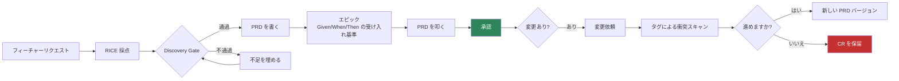
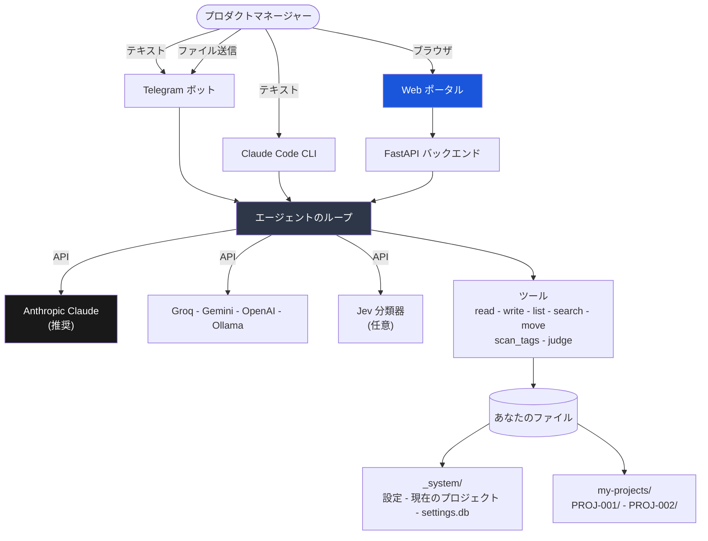

[🇺🇸 English](../README.md)

<p align="center">
  <strong>Product Management Skill Jev</strong>
</p>

<p align="center">
  ドキュメントを書き、プロセスを守り、判断はすべてあなたに残す<br/>
  プロダクトマネジメントの副操縦士。入力は普通の言葉、出力は素の markdown。
</p>

<p align="center">
  <a href="https://www.anthropic.com/"></a>
  <a href="https://www.python.org/"></a>
  <a href="https://nextjs.org/"></a>
  <a href="https://www.docker.com/"></a>
  <a href="https://telegram.org/"></a>
  
  
</p>

<p align="center">
  🌐 <a href="../README.md">🇺🇸 English</a> ·
  <a href="README.vi.md">🇻🇳 Tiếng Việt</a> ·
  <a href="README.zh-CN.md">🇨🇳 中文</a> ·
  <a href="README.fr.md">🇫🇷 Français</a> ·
  🇯🇵 日本語（このページ）·
  <a href="README.es.md">🇪🇸 Español</a>
</p>

> この翻訳は[英語版](../README.md)より数バージョン遅れている場合があります。英語版が正本です。

---

## はじめに

プロダクトマネージャーの一週間は、その大半が書類仕事に溶けていきます。スプリントプランニング
まで誰も開かない PRD を書く。表計算ファイルが別のノート PC にあるせいで RICE スコアを計算し
直す。木曜になって、二つのチームが同じエンドポイントを作り直していたと気づく。

このプロジェクトは、その作業を引き受けます。ただし判断まで持っていったりはしません。普通の
文章で必要なことを伝えると、足りない事実を聞き返し、ドキュメントを起草し、下書きを見せます。
あなたが「はい」と言うまで、何ひとつファイルには書き込まれません。

生成物はすべて、あなたの手元のフォルダにある素の markdown です。読めないデータベースも、
エクスポートボタンも、囲い込みもありません。明日このツールを消しても、PRD はそこに残り、
どんなテキストエディタでも開けます。

**これは何ではないか。** 顧客との会話を代行はしませんし、何を作るべきかも教えません。文章が
うまく、何も忘れない。それは判断力とは別の能力です。判断はあなたのものであり、仕組み全体が
そう保つために作られています。

---

## 一分で分かる考え方

```
あなたが書く  ->  必要なことを尋ねる  ->  下書きを見せる  ->  あなたが承認  ->  ファイルに書く
```

三つのルールが全体を支えています。

1. **起草するのは AI、決めるのはあなた。** 内容を見せ、同意を得ないまま作成も変更もしません。
2. **承認済みは凍結。** 一度サインオフされた PRD は二度と変わりません。変更は新しいバージョン
   となり、それを引き起こした変更依頼と結び付けられます。
3. **黙って消えるものはない。** すべてのバージョン、決定、ステークホルダーの意見が記録され、
   互いにリンクされます。

---

## 最初の会話

実際に使うと、こんな具合です。

```
あなた  チェックアウト刷新の新しいプロジェクトを作って

Jev     作る前に四つだけ確認します。
        プロダクト、優先度（P0 から P3）、目標終了日、そして目的を一文で。

あなた  Payments、P1、30/11/2026、モバイルのチェックアウト離脱を減らす

Jev     これが下書きです。はいと言えば作成します。

        my-projects/PROJ-002-checkout-redesign/
          PROJECT.md      目的、マイルストーン、紐づく FR と PRD
          VERSIONS.md     ドキュメント台帳
          discovery/ prd/ epics/ cr/ stakeholders/ decisions/ sprints/

あなた  はい

Jev     作成しました。PROJ-002 が現在のプロジェクトです。
        次は「[作りたいもの] のフィーチャーリクエストを作って」

あなた  ワンタップ Apple Pay のフィーチャーリクエストを作って

Jev     二つ質問です。誰の要望で、どんな課題を解きますか。

あなた  モバイルのユーザー。カード入力画面で離脱している。

Jev     FR-004 の下書きです。読んだら保存と言ってください。
        ... 課題、ユーザー、要望されている解決策 ...

あなた  保存して

Jev     discovery/inbox/FR-004-one-tap-apple-pay.md に保存しました。
        次は「FR-004 を RICE で採点して」
```

ここから先は、採点し、調査し、Discovery Gate を通し、PRD にして、Given/When/Then の受け入れ
基準を持つエピックに分解していきます。各ステップが次を提案するので、順番を覚える必要はあり
ません。

---

## 最終的に手元に残るもの

プロジェクトごとに一つのフォルダ。そしてそれはすべてあなたのものです。

```
my-projects/PROJ-002-checkout-redesign/
  PROJECT.md                    目的、マイルストーン、関連ドキュメント
  VERSIONS.md                   すべてのドキュメントとその状態
  roadmap.md
  discovery/
    inbox/       FR-004-one-tap-apple-pay.md
    scoring/     RICE-004-one-tap-apple-pay.md
    research/    RS-004-payment-providers.md
    gate/        approved.md - rejected.md - backlog.md
  prd/
    PRD-004-one-tap-checkout/
      PRD-004-v1.0.md           承認済み。以後編集しない
      PRD-004-v1.1.md           変更依頼が生んだバージョン
      CHANGELOG.md
  epics/
    EP-007-apple-pay-sheet/EP-007-v1.0.md
  cr/
    intake/ - assessment/ - approval-board/ - approved/ - rejected/
    cr-log.md
  stakeholders/  SH-003-robert-engineering-lead.md
  decisions/ - reviews/ - sprints/
```

Obsidian でも VS Code でも Notion でも開けます。git に入れれば、PRD の履歴が本当に読める
diff になります。

---

## 仕事の流れ



Gate は、飛ばして後悔することになる工程です。スコアがあり、裏付けとなる調査があり、そして
認証、個人データ、決済、監査ログに触れる場合は本物のセキュリティ分析があること。それまで
機能は PRD になりません。最後の確認は助言ではなく、実際に通行を止めます。

---

## はじめかた

### 1. クローンする

```bash
git clone https://github.com/taman-spirit/product-skill-jev.git my-pm-workspace
cd my-pm-workspace
cp .env.example .env
```

`.env` を開き、まずキーを一つ設定します。

```env
ANTHROPIC_API_KEY=sk-ant-your_key_here
```

### 2. 何を動かすか選ぶ

```bash
bash setup.sh
```

```
What would you like to install?

  1) Telegram bot only
  2) Web portal only
  3) Web portal + Telegram bot  <- recommended

Enter option [1/2/3]:
```

初回インストール時にサンプルプロジェクトが `my-projects/` にコピーされるので、自分で書き始
める前に本物のドキュメントを触って確かめられます。

### 3. 挨拶してみる

Telegram で `/start` を送るか、Web ポータルのチャットに打ち込みます。まずは
`Show all projects` から。ほとんど費用はかからず、全体の形が見えます。

---

## 三つの使い方

| 窓口 | 向いている場面 | 始め方 |
|------|---------------|--------|
| **Telegram ボット** | 外出先で思いつきを拾う、会議の合間の状況確認 | `make start` のあと `/start` |
| **Web ポータル** | 本格的な作業。左にチャット、右に書いているドキュメント | `cd apps && make start` |
| **Claude Code** | リポジトリの中で作業する。スキルが自動で読み込まれる | フォルダを開く |

### Web ポータル

```
+---------------------------------+----------------------------+
|  Chat                           |  File viewer               |
|                                 |                            |
|  You: Create a feature request  |  FR-004-apple-pay.md       |
|       for one-tap Apple Pay     |  -----------------         |
|                                 |  ---                       |
|  Jev: Two questions...          |  fr-id: FR-004             |
|                                 |  status: draft             |
|  [write_file] --------------->  |  [Refresh]                 |
+---------------------------------+----------------------------+
```

画面は四つ。ファイルを横で見られる **Chat**、ドキュメントを閲覧・編集する **Projects**、API
キーを扱う **Settings**、そして全変更の時系列を追う **Audit Log**。Web の UI は現在英語です。

---

## 内部のしくみ



エージェントが持つツールは七つだけです。五つはファイルの読み書き。`scan_tags` は素の Python
で、どの PRD が同じモジュールを共有しているかを決定的に割り出します。`judge` は任意の Jev
分類器に型付きの判断を求めます。エージェントができることはすべて `AGENT.md` と下記のスキルに
英語で書かれており、読んで書き換えられます。

### スキル

各スキルは `.claude/skills/` 配下のフォルダで、`SKILL.md` を一つ持ちます。Claude Code は説明
文から見つけます。ボットと Web バックエンドは `AGENT.md` の索引を通して引きます。

| 領域 | スキル |
|------|--------|
| Discovery | create-fr, score-feature, gate-review, deep-research |
| PRD | to-prd, manage-epic, conflict-check, grill-prd, update-prd |
| プロジェクト | create-project, find-project, project-status |
| 変更依頼 | intake-cr, assess-cr, approve-cr |
| ステークホルダー | add-stakeholder, draft-comms |
| 基盤 | setup-workspace, new-sprint, version-doc, product-skill-jev |

全部で二十一個。ひとつ開いて読んでみてください。コードではなく指示書なので、書き換えれば
システムの振る舞いが変わります。

---

## 守っているルール

**下書きを必ず見せます。** どのスキルも終わり方は同じです。こう書くつもりですが、よいですか。
礼儀ではなく、設計です。

**承認済みのドキュメントは変わりません。** サインオフされた PRD は凍結されます。違うものが
必要なら変更依頼を出してください。承認すると理由付きで v1.1 か v2.0 が生まれます。

**ステークホルダーは記憶されます。** 一度その人を説明すればプロフィールができます。発言を
伝えるとフィードバックを保存し、ドキュメントを走査して、何かに触れる前に更新が要りそうな
箇所を見せます。

**衝突はコードが見つけます。当て推量ではありません。** Python のスキャンが全 PRD を読み、
モジュールタグを共有する組み合わせをすべて返します。タグのない PRD は「確認できない」と報告
されます。これは「衝突がない」とは別物です。共有タグが本当の衝突かどうかをモデルに尋ねるのは
その後です。

**AI プロバイダは切り替えられます。** 複数のキーを保存し、クリックひとつで有効化。ドキュメント
の品質では Claude を推奨します。試すだけなら Groq の無料枠で十分です。

---

## モデルを選ぶ

ここに挙げた選択肢の中では、Claude が最も良い PRD、エピック、ステークホルダー向けメールを
書きます。キーは **https://console.anthropic.com/settings/keys** で取得してください。

| モデル | 100万トークンあたり | 向いている用途 |
|--------|--------------------|---------------|
| `claude-sonnet-4-6` | $3 / $15 | 日々の作業。まずはここから |
| `claude-opus-4-7` | $5 / $25 | 長い PRD、込み入った分析 |
| `claude-haiku-4-5` | $1 / $5 | 手早い確認 |

他のプロバイダでも動きます。

| プロバイダ | 設定 | 費用 | 備考 |
|-----------|------|------|------|
| **Anthropic Claude** | `AI_PROVIDER=anthropic` | $1 から $25 / 100万 | 推奨 |
| Groq | `AI_PROVIDER=openai` と Groq の URL | 無料枠 | 試用に良い |
| Google Gemini | `AI_PROVIDER=google` | 無料枠 | 毎分15リクエスト |
| OpenAI | `AI_PROVIDER=openai` | $0.15 から $10 / 100万 | GPT-4o か mini |
| Ollama | `AI_PROVIDER=openai` と localhost | 無料 | ローカル GPU が必要 |

---

## Jev、速い分類器（任意）

Jev は TypeSafe AI の System One モデルです。文章は書きません。テキストと型付きの質問を渡す
と、おおよそ 70 から 500 ミリ秒で、較正済みの確率付きラベルを返します。主プロバイダの代わり
ではなく隣で動き、キーを与えなければ統合全体が眠ったままです。

三つは Python 側で、エージェントが入力を見る前に動きます。

- **ステークホルダーの意見**が種類と緊急度で分類され、フィードバックログの `Sentiment` 欄は
  推測ではなく提案になります。
- **コマンドの振り分け**が、主プロバイダのエラー時やレート制限時に英語キーワード頼みでなく
  なります。
- **アップロードされたファイル**に、質問ではなく保存先フォルダの提案が付きます。

残る五つは `judge` ツール経由です。ファイルの中身を持っているのはエージェントだけだからです。

| 質問セット | 使う場面 | 何が増えるか |
|-----------|---------|-------------|
| `fr_triage` | create-fr | 実は変更依頼であるアイデアや、セキュリティに触れるアイデアを見抜く |
| `gate_review` | gate-review | セキュリティ節が見出しだけで中身がないとき Gate を止める |
| `rice_bands` | score-feature | 質問の中で目安を提案する。値を代わりに埋めることはしない |
| `cr_assessment` | assess-cr | スコープの増分と、PRD が v2.0 か v1.1 のどちらを要するか |
| `conflict_pair` | 衝突スキャン | `scan_tags` が見つけた組み合わせを順位付けする。自分では見つけない |

Jev がファイルを書くことはありません。キーがない、リクエストがタイムアウトした、確信度が
しきい値を下回った。いずれの場合も、Jev が入る前のシステムの動きに戻ります。

```
TYPESAFE_API_KEY=            # 空のままなら Jev なしで動く
TYPESAFE_DEFAULT_MODEL=jev-latest
# TYPESAFE_BASE_URL=         # 既定は https://api.typesafe.ai
# TYPESAFE_TIMEOUT=3.0
```

すべての質問と既定のしきい値は `bot/jev.py` にあり、その根拠となった実測値のすぐ隣に置かれて
います。ポータルの Settings 画面からキーの設定、Jev のオフ、任意のしきい値の上書きができます。
上書き値は既定値の上に重なり、どれが既定から外れているかが画面に示され、ボタンひとつで実測
された一式に戻せます。しきい値を変えても裏側の測定はやり直されません。だから画面はそれを先に
伝えます。

詳しい指針は `.claude/skills/product-skill-jev` にあります。

---

## 日常のコマンド

```bash
# Telegram ボット。リポジトリのルートで
make start      # 起動
make stop       # 停止
make restart    # 再起動
make update     # イメージを作り直して再起動
make logs       # ログを追う
make status     # 稼働確認

# Web ポータル。apps/ の中で
cd apps
make start
make stop
make logs
make build      # コード変更後に作り直す
```

---

## テスト

```bash
# すべて（170 テスト）
cd apps/backend && python3 -m pytest ../../tests/ -v

# 領域ごと
python3 -m pytest tests/test_installation.py   # 35
python3 -m pytest tests/test_agent_tools.py    # 26
python3 -m pytest tests/test_backend_api.py    # 26
python3 -m pytest tests/test_jev.py            # 61
python3 -m pytest tests/test_tags.py           # 22
```

一部のテストは `bot/bot.py` を import するため Python 3.10 以上が必要です。それより古い
インタプリタでは自動的にスキップされます。Docker の 3.12 では全件が走ります。

---

## よくある質問

**技術者でなくても使えますか。** 使えます。あなたは文章を書くだけで、フォルダ、ID、テンプ
レート、相互リンクはこちらが扱います。

**データはどこにありますか。** あなた自身のフォルダの markdown ファイルです。他のどこにも
保存されません。

**チームで一つのワークスペースを共有できますか。** できます。git か共有ドライブでフォルダを
共有してください。git の方が良いのは、そうすればドキュメントの履歴が本物の履歴になるからです。

**ファイルを手で編集してもよいですか。** どうぞ。markdown です。ただし承認済みのドキュメント
は凍結しておくものだ、ということは忘れずに。忘れてもシステムが指摘します。

**返事が来なくなったら。** Settings を開き、キーが保存されているか、有効なプロバイダが緑に
なっているかを確認してください。

**Jev は必須ですか。** いいえ。`TYPESAFE_API_KEY` を空にしておけば、Jev が入る前とまったく
同じように動きます。

---

## このプロジェクトを形づくった文献

| 領域 | 出典 |
|------|------|
| スキルの形式 | [mattpocock/skills](https://github.com/mattpocock/skills) |
| 機能の採点 | [RICE Scoring](https://www.intercom.com/blog/rice-simple-prioritization-for-product-managers/)、Intercom |
| プロダクトディスカバリー | [Continuous Discovery Habits](https://www.producttalk.org/)、Teresa Torres |
| PRD の基準 | [Inspired](https://www.svpg.com/books/inspired-how-to-create-tech-products-customers-love-2nd-edition/)、Marty Cagan |
| ユーザーストーリー | [Writing Good User Stories](https://www.mountaingoatsoftware.com/agile/user-stories)、Mike Cohn |
| 意思決定の記録 | [Architectural Decision Records](https://adr.github.io/) |

---

CC BY-NC 4.0 - [Creative Commons Attribution-NonCommercial 4.0](https://creativecommons.org/licenses/by-nc/4.0/)
