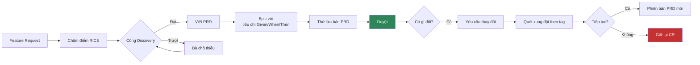
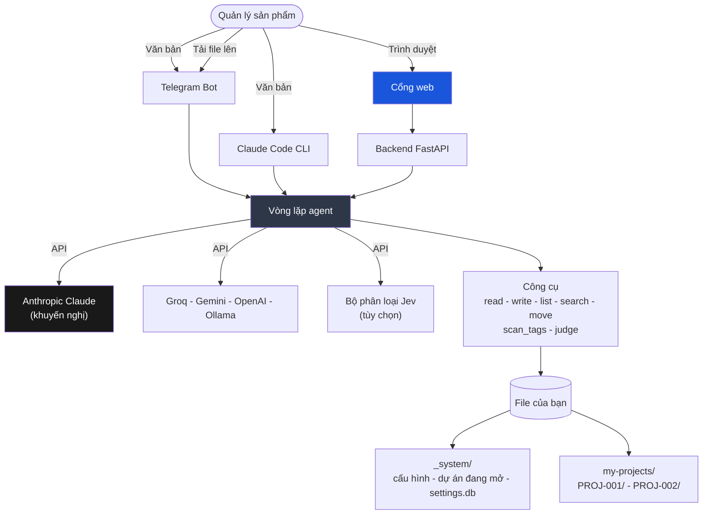

[🇺🇸 English](../README.md)

<p align="center">
  <strong>Product Management Skill Jev</strong>
</p>

<p align="center">
  Một trợ lý quản lý sản phẩm viết hộ bạn tài liệu, giữ quy trình cho nghiêm,<br/>
  và để mọi quyết định lại cho bạn. Vào bằng lời nói thường, ra bằng markdown thường.
</p>

<p align="center">
  <a href="https://www.anthropic.com/"></a>
  <a href="https://www.python.org/"></a>
  <a href="https://nextjs.org/"></a>
  <a href="https://www.docker.com/"></a>
  <a href="https://telegram.org/"></a>
  
  
</p>

<p align="center">
  🌐 <a href="../README.md">🇺🇸 English</a> ·
  🇻🇳 Tiếng Việt (bạn đang ở đây) ·
  <a href="README.zh-CN.md">🇨🇳 中文</a> ·
  <a href="README.fr.md">🇫🇷 Français</a> ·
  <a href="README.ja.md">🇯🇵 日本語</a> ·
  <a href="README.es.md">🇪🇸 Español</a>
</p>

> Bản dịch này có thể chậm hơn [bản tiếng Anh](../README.md) một vài phiên bản. Bản tiếng Anh là bản gốc.

---

## Xin chào

Phần lớn một tuần của người quản lý sản phẩm tan vào giấy tờ. Viết bản PRD mà không ai đọc
cho tới buổi sprint planning. Tính lại điểm RICE vì file bảng tính đang nằm ở máy khác. Đến
thứ Năm mới phát hiện hai đội cùng xây lại một endpoint.

Dự án này gánh phần việc đó cho bạn mà không giành mất quyền quyết định. Bạn mô tả nhu cầu
bằng câu nói bình thường. Nó hỏi lại những gì cần biết, soạn tài liệu, rồi đưa bản nháp cho
bạn xem. Không có gì được ghi vào file cho tới khi bạn đồng ý.

Mọi thứ nó tạo ra đều là markdown thuần trong thư mục của bạn. Không có cơ sở dữ liệu nào
bạn không đọc được, không cần nút xuất file, không bị khóa chân. Xóa công cụ này ngày mai
thì các bản PRD vẫn nằm nguyên đó, mở bằng trình soạn thảo nào cũng đọc được.

**Nó không phải cái gì.** Nó không đi nói chuyện với khách hàng thay bạn, và nó không bảo
bạn nên xây gì. Nó viết tốt và nó không quên gì cả, đó là một kỹ năng khác với phán đoán.
Phán đoán vẫn là của bạn, và toàn bộ hệ thống được dựng lên để giữ đúng như vậy.

---

## Ý tưởng trong một phút

```
Bạn gõ  ->  Nó hỏi thứ nó cần  ->  Nó đưa bản nháp  ->  Bạn xác nhận  ->  Nó ghi file
```

Ba luật giữ cả hệ thống đứng vững.

1. **Nó soạn nháp, bạn quyết.** Không file nào được tạo hay sửa mà bạn chưa nhìn thấy nội
   dung trước và chưa nói đồng ý.
2. **Đã duyệt là đóng băng.** Một bản PRD đã ký duyệt thì không bao giờ đổi nữa. Muốn đổi
   thì tạo phiên bản mới, gắn với yêu cầu thay đổi đã gây ra nó.
3. **Không gì mất đi trong im lặng.** Mọi phiên bản, mọi quyết định, mọi ý kiến của các bên
   liên quan đều được ghi lại và liên kết với nhau.

---

## Cuộc hội thoại đầu tiên

Dùng nó thực tế trông như thế này.

```
Bạn   Tạo dự án mới cho việc thiết kế lại luồng thanh toán

Jev   Trước khi tạo, tôi cần bốn thứ:
      sản phẩm, độ ưu tiên (P0 tới P3), ngày kết thúc dự kiến, và mục tiêu trong một câu.

Bạn   Payments, P1, 30/11/2026, giảm tỉ lệ bỏ giỏ hàng trên mobile

Jev   Đây là bản nháp. Nói đồng ý là tôi tạo.

      my-projects/PROJ-002-checkout-redesign/
        PROJECT.md      mục tiêu, cột mốc, FR và PRD liên kết
        VERSIONS.md     sổ đăng ký tài liệu
        discovery/ prd/ epics/ cr/ stakeholders/ decisions/ sprints/

Bạn   đồng ý

Jev   Đã tạo. PROJ-002 giờ là dự án đang hoạt động.
      Tiếp theo: "Tạo feature request cho [thứ bạn muốn xây]"

Bạn   Tạo feature request cho Apple Pay một chạm

Jev   Hai câu hỏi. Ai là người đề xuất, và nó giải quyết vấn đề gì?

Bạn   Người dùng mobile. Chúng ta mất họ ở màn hình nhập thẻ.

Jev   Bản nháp FR-004. Đọc rồi bảo tôi lưu.
      ... vấn đề, người dùng, giải pháp được đề xuất ...

Bạn   lưu đi

Jev   Đã lưu vào discovery/inbox/FR-004-one-tap-apple-pay.md
      Tiếp theo: "Chấm điểm RICE cho FR-004"
```

Từ đó đường đi là: chấm điểm, nghiên cứu, đưa qua cổng Discovery, chuyển thành PRD, rồi
tách PRD thành các epic có tiêu chí chấp nhận dạng Given/When/Then. Mỗi bước đều gợi ý bước
kế tiếp, nên bạn không phải thuộc lòng thứ tự.

---

## Thứ bạn nhận được

Một thư mục cho mỗi dự án, và tất cả thuộc về bạn.

```
my-projects/PROJ-002-checkout-redesign/
  PROJECT.md                    mục tiêu, cột mốc, tài liệu liên kết
  VERSIONS.md                   mọi tài liệu và trạng thái của nó
  roadmap.md
  discovery/
    inbox/       FR-004-one-tap-apple-pay.md
    scoring/     RICE-004-one-tap-apple-pay.md
    research/    RS-004-payment-providers.md
    gate/        approved.md - rejected.md - backlog.md
  prd/
    PRD-004-one-tap-checkout/
      PRD-004-v1.0.md           đã duyệt, không bao giờ sửa lại
      PRD-004-v1.1.md           phiên bản do một yêu cầu thay đổi sinh ra
      CHANGELOG.md
  epics/
    EP-007-apple-pay-sheet/EP-007-v1.0.md
  cr/
    intake/ - assessment/ - approval-board/ - approved/ - rejected/
    cr-log.md
  stakeholders/  SH-003-robert-engineering-lead.md
  decisions/ - reviews/ - sprints/
```

Mở bất kỳ file nào bằng Obsidian, VS Code hay Notion. Commit vào git thì lịch sử PRD của
bạn trở thành một bản diff đọc được thật sự.

---

## Công việc chảy như thế nào



Cổng Discovery là bước người ta hay bỏ qua rồi sau đó hối. Một tính năng chưa được thành
PRD cho tới khi nó có điểm số, có nghiên cứu đứng sau, và có phân tích bảo mật thật khi nó
chạm tới xác thực, dữ liệu cá nhân, thanh toán hay nhật ký kiểm toán. Kiểm tra cuối cùng đó
không phải lời khuyên. Nó chặn.

---

## Bắt đầu

### 1. Clone về

```bash
git clone https://github.com/taman-spirit/product-skill-jev.git my-pm-workspace
cd my-pm-workspace
cp .env.example .env
```

Mở `.env` và đặt một key để bắt đầu.

```env
ANTHROPIC_API_KEY=sk-ant-your_key_here
```

### 2. Chọn thứ muốn chạy

```bash
bash setup.sh
```

```
What would you like to install?

  1) Telegram bot only
  2) Web portal only
  3) Web portal + Telegram bot  <- recommended

Enter option [1/2/3]:
```

Một dự án mẫu được chép vào `my-projects/` ngay lần cài đầu tiên, để bạn có tài liệu thật
mà nghịch trước khi tự viết.

### 3. Chào một câu

Mở Telegram gửi `/start`, hoặc mở cổng web rồi gõ vào khung chat. Thử `Show all projects`
trước. Nó gần như không tốn gì và cho bạn thấy hình dáng của hệ thống.

---

## Ba cách nói chuyện với nó

| Giao diện | Hợp với | Bắt đầu bằng |
|-----------|---------|--------------|
| **Telegram bot** | Chộp một ý tưởng trên điện thoại, xem tình hình giữa hai cuộc họp | `make start` rồi `/start` |
| **Cổng web** | Làm việc thật. Chat bên trái, tài liệu đang viết bên phải | `cd apps && make start` |
| **Claude Code** | Làm ngay trong repository, nơi các skill tự nạp | mở thư mục lên |

### Cổng web

```
+---------------------------------+----------------------------+
|  Chat                           |  File viewer               |
|                                 |                            |
|  You: Create a feature request  |  FR-004-apple-pay.md       |
|       for one-tap Apple Pay     |  -----------------         |
|                                 |  ---                       |
|  Jev: Two questions...          |  fr-id: FR-004             |
|                                 |  status: draft             |
|  [write_file] --------------->  |  [Refresh]                 |
+---------------------------------+----------------------------+
```

Bốn màn hình. **Chat** kèm khung xem file trực tiếp, **Projects** để duyệt và sửa tài liệu,
**Settings** cho các API key, và **Audit Log** là dòng thời gian của mọi thay đổi. Giao diện
web hiện dùng tiếng Anh.

---

## Bên trong



Agent có bảy công cụ và không có gì khác. Năm cái đọc và ghi file. `scan_tags` xác định
những PRD nào dùng chung một module, một cách tất định, bằng Python thuần. `judge` hỏi bộ
phân loại Jev tùy chọn để lấy một nhận định có kiểu. Mọi thứ agent biết làm đều nằm trong
`AGENT.md` và các skill dưới đây, viết bằng tiếng Anh mà bạn đọc và sửa được.

### Các skill

Mỗi skill là một thư mục trong `.claude/skills/` chứa đúng một file `SKILL.md`. Claude Code
tìm thấy chúng qua phần mô tả. Bot và backend web tra chúng qua bảng chỉ mục trong
`AGENT.md`.

| Nhóm | Skill |
|------|-------|
| Discovery | create-fr, score-feature, gate-review, deep-research |
| PRD | to-prd, manage-epic, conflict-check, grill-prd, update-prd |
| Dự án | create-project, find-project, project-status |
| Yêu cầu thay đổi | intake-cr, assess-cr, approve-cr |
| Bên liên quan | add-stakeholder, draft-comms |
| Nền tảng | setup-workspace, new-sprint, version-doc, product-skill-jev |

Hai mươi mốt cái. Mở một cái ra đọc thử. Chúng là hướng dẫn chứ không phải code, và sửa một
cái là đổi cách hệ thống hành xử.

---

## Những luật nó giữ

**Nó đưa bản nháp cho bạn xem.** Mọi skill đều kết thúc giống nhau: đây là thứ tôi định
viết, đồng ý chứ. Đó không phải phép lịch sự, đó là thiết kế.

**Tài liệu đã duyệt thì không đổi.** Một bản PRD đã ký duyệt là đóng băng. Muốn khác đi thì
tạo yêu cầu thay đổi. Duyệt nó sẽ sinh ra v1.1 hoặc v2.0 kèm lý do.

**Các bên liên quan được ghi nhớ.** Mô tả một người một lần là bạn có hồ sơ của họ. Kể lại
họ nói gì thì nó lưu ý kiến, quét các tài liệu của bạn, và chỉ ra chỗ nào có thể cần cập
nhật, trước khi động vào bất cứ thứ gì.

**Xung đột do code tìm ra, không phải đoán mò.** Một đoạn quét Python đọc mọi PRD và trả về
đầy đủ các cặp dùng chung tag module. PRD không có tag được báo là "không kiểm tra được",
khác hẳn với "không có xung đột". Chỉ sau đó mới hỏi mô hình xem tag chung có phải va chạm
thật hay không.

**Bạn đổi được nhà cung cấp AI.** Lưu nhiều key, kích hoạt một cái bằng một cú bấm. Claude
được khuyến nghị vì chất lượng tài liệu. Gói miễn phí của Groq đủ dùng để thử nghiệm.

---

## Chọn mô hình

Trong các lựa chọn ở đây, Claude viết PRD, epic và email cho các bên liên quan tốt nhất. Lấy
key tại **https://console.anthropic.com/settings/keys**.

| Mô hình | Mỗi 1M token | Hợp với |
|---------|--------------|---------|
| `claude-sonnet-4-6` | $3 / $15 | Việc hằng ngày. Bắt đầu ở đây |
| `claude-opus-4-7` | $5 / $25 | PRD dài, phân tích rối |
| `claude-haiku-4-5` | $1 / $5 | Tra cứu nhanh |

Các nhà cung cấp khác cũng chạy được.

| Nhà cung cấp | Cấu hình | Chi phí | Ghi chú |
|--------------|----------|---------|---------|
| **Anthropic Claude** | `AI_PROVIDER=anthropic` | $1 tới $25 / 1M | Khuyến nghị |
| Groq | `AI_PROVIDER=openai` kèm URL của Groq | Gói miễn phí | Tốt để thử |
| Google Gemini | `AI_PROVIDER=google` | Gói miễn phí | 15 request mỗi phút |
| OpenAI | `AI_PROVIDER=openai` | $0.15 tới $10 / 1M | GPT-4o hoặc mini |
| Ollama | `AI_PROVIDER=openai` kèm localhost | Miễn phí | Cần GPU tại chỗ |

---

## Jev, bộ phân loại nhanh (tùy chọn)

Jev là mô hình System One của TypeSafe AI. Nó không sinh văn bản. Bạn đưa cho nó văn bản và
các câu hỏi có kiểu, nó trả về nhãn kèm xác suất đã hiệu chuẩn trong khoảng 70 tới 500 mili
giây. Nó chạy song song với nhà cung cấp chính chứ không thay thế, và toàn bộ phần tích hợp
nằm im nếu bạn không đưa key.

Ba việc chạy trong Python, trước khi agent nhìn thấy đầu vào của bạn.

- **Ý kiến của bên liên quan** được phân loại theo kiểu và mức khẩn, nên trường `Sentiment`
  trong nhật ký phản hồi là gợi ý chứ không phải đoán.
- **Định tuyến lệnh** thôi phụ thuộc vào từ khóa tiếng Anh khi nhà cung cấp chính lỗi hoặc
  bị giới hạn tần suất.
- **File tải lên** được đề xuất thư mục đích thay vì bị hỏi.

Năm việc nữa chạy qua công cụ `judge`, vì chỉ agent mới cầm nội dung file.

| Bộ câu hỏi | Ở đâu | Thêm được gì |
|------------|-------|--------------|
| `fr_triage` | create-fr | Phát hiện ý tưởng thực ra là yêu cầu thay đổi, hoặc chạm tới bảo mật |
| `gate_review` | gate-review | Chặn cổng khi mục Security chỉ có tiêu đề mà rỗng ruột |
| `rice_bands` | score-feature | Gợi ý dải điểm ngay trong câu hỏi, không bao giờ tự điền |
| `cr_assessment` | assess-cr | Mức mở rộng phạm vi, và PRD cần v2.0 hay v1.1 |
| `conflict_pair` | quét xung đột | Xếp hạng các cặp mà `scan_tags` đã tìm ra. Nó không tự tìm |

Jev không bao giờ ghi file. Khi thiếu key, khi request hết giờ, hay khi độ tin cậy dưới
ngưỡng, mọi nhánh đều quay về đúng hành vi hệ thống có trước khi Jev xuất hiện.

```
TYPESAFE_API_KEY=            # để trống là chạy mà không có Jev
TYPESAFE_DEFAULT_MODEL=jev-latest
# TYPESAFE_BASE_URL=         # mặc định https://api.typesafe.ai
# TYPESAFE_TIMEOUT=3.0
```

Mọi câu hỏi và mọi ngưỡng mặc định nằm trong `bot/jev.py`, ngay cạnh các số đo mà chúng được
chốt dựa trên. Trang Settings của cổng web đặt được key, tắt được Jev, và ghi đè được bất kỳ
ngưỡng nào. Giá trị ghi đè chồng lên mặc định, trang web chỉ rõ cái nào đang lệch, và một
nút đưa tất cả về bộ đã đo. Sửa một ngưỡng không làm phép đo chạy lại, nên trang web nói
trước điều đó.

Hướng dẫn đầy đủ nằm ở `.claude/skills/product-skill-jev`.

---

## Lệnh dùng hằng ngày

```bash
# Telegram bot, chạy từ thư mục gốc
make start      # khởi động
make stop       # dừng
make restart    # khởi động lại
make update     # build lại image rồi khởi động lại
make logs       # xem log trực tiếp
make status     # kiểm tra sức khỏe

# Cổng web, chạy từ apps/
cd apps
make start
make stop
make logs
make build      # build lại sau khi sửa code
```

---

## Kiểm thử

```bash
# toàn bộ (170 test)
cd apps/backend && python3 -m pytest ../../tests/ -v

# theo nhóm
python3 -m pytest tests/test_installation.py   # 35
python3 -m pytest tests/test_agent_tools.py    # 26
python3 -m pytest tests/test_backend_api.py    # 26
python3 -m pytest tests/test_jev.py            # 61
python3 -m pytest tests/test_tags.py           # 22
```

Vài test import `bot/bot.py`, vốn cần Python 3.10 trở lên. Chúng tự bỏ qua trên bản thông
dịch cũ hơn. Trên 3.12 trong Docker thì cả bộ đều chạy.

---

## Những câu hay được hỏi

**Tôi có cần biết kỹ thuật không?** Không. Bạn gõ câu thường. Nó lo thư mục, mã ID, biểu mẫu
và các liên kết chéo.

**Dữ liệu của tôi nằm ở đâu?** Là file markdown trong thư mục của chính bạn. Không có gì
được lưu ở nơi khác.

**Nhiều người dùng chung một workspace được không?** Được. Chia sẻ thư mục qua git hoặc ổ
đĩa chung. Git tốt hơn, vì khi đó lịch sử tài liệu là lịch sử thật.

**Tôi sửa file bằng tay được không?** Cứ tự nhiên. Đó là markdown. Chỉ nhớ rằng tài liệu đã
duyệt là để đóng băng, và hệ thống sẽ nhắc nếu bạn quên.

**Nếu nó không trả lời thì sao?** Mở Settings kiểm tra xem đã lưu key chưa và nhà cung cấp
đang hoạt động có hiện đèn xanh không.

**Có bắt buộc dùng Jev không?** Không. Để trống `TYPESAFE_API_KEY` là mọi thứ chạy đúng như
trước khi Jev được thêm vào.

---

## Tài liệu đã định hình dự án này

| Lĩnh vực | Nguồn |
|----------|-------|
| Định dạng skill | [mattpocock/skills](https://github.com/mattpocock/skills) |
| Chấm điểm tính năng | [RICE Scoring](https://www.intercom.com/blog/rice-simple-prioritization-for-product-managers/), Intercom |
| Khám phá sản phẩm | [Continuous Discovery Habits](https://www.producttalk.org/), Teresa Torres |
| Chuẩn mực PRD | [Inspired](https://www.svpg.com/books/inspired-how-to-create-tech-products-customers-love-2nd-edition/), Marty Cagan |
| User story | [Writing Good User Stories](https://www.mountaingoatsoftware.com/agile/user-stories), Mike Cohn |
| Ghi nhận quyết định | [Architectural Decision Records](https://adr.github.io/) |

---

CC BY-NC 4.0 - [Creative Commons Attribution-NonCommercial 4.0](https://creativecommons.org/licenses/by-nc/4.0/)
