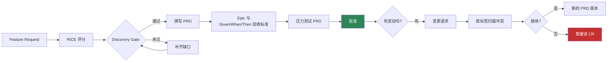
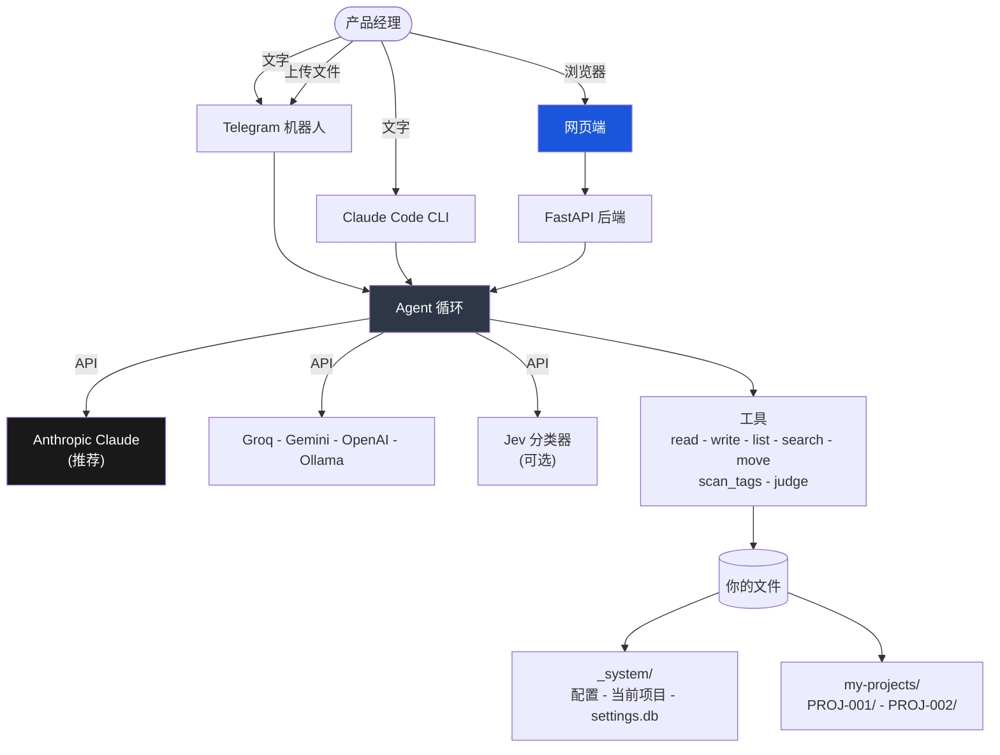

[🇺🇸 English](../README.md)

<p align="center">
  <strong>Product Management Skill Jev</strong>
</p>

<p align="center">
  一个产品管理副驾驶：文档它来写，流程它来守，决定仍然归你。<br/>
  输入是日常语言，输出是纯 markdown。
</p>

<p align="center">
  <a href="https://www.anthropic.com/"></a>
  <a href="https://www.python.org/"></a>
  <a href="https://nextjs.org/"></a>
  <a href="https://www.docker.com/"></a>
  <a href="https://telegram.org/"></a>
  
  
</p>

<p align="center">
  🌐 <a href="../README.md">🇺🇸 English</a> ·
  <a href="README.vi.md">🇻🇳 Tiếng Việt</a> ·
  🇨🇳 中文（当前页面）·
  <a href="README.fr.md">🇫🇷 Français</a> ·
  <a href="README.ja.md">🇯🇵 日本語</a> ·
  <a href="README.es.md">🇪🇸 Español</a>
</p>

> 此翻译可能落后于[英文版](../README.md)若干个版本。英文版为准。

---

## 你好

产品经理一周的大半时间消耗在文书上。写一份到了 sprint planning 才有人翻开的 PRD。因为表格
存在另一台电脑上，只好把 RICE 分数重算一遍。到了周四才发现两个团队在重写同一个接口。

这个项目替你接下这些活，但不顺手把决定权也拿走。你用平常的句子说明需求，它问清缺少的事实，
起草文档，然后把草稿摆在你面前。在你说「可以」之前，没有任何内容会落进文件。

它产出的一切都是你自己目录里的纯 markdown。没有你读不懂的数据库，不需要导出按钮，也谈不上
被锁定。明天删掉这个工具，PRD 仍旧躺在原处，任何文本编辑器都打得开。

**它不是什么。** 它不会替你去找客户聊，也不会告诉你该做什么。它写得好、记性好，那和判断力是
两回事。判断仍然是你的，整套系统就是为了守住这一点而设计的。

---

## 一分钟讲清思路

```
你输入  ->  它问所需信息  ->  它给出草稿  ->  你确认  ->  它写入文件
```

三条规则支撑起整个系统。

1. **它起草，你拍板。** 没有哪个文件会在你没看过内容、没点头之前被创建或修改。
2. **批准即冻结。** PRD 一旦签署就不再改动。要改就出新版本，并和引发它的变更请求绑在一起。
3. **不会悄无声息地丢东西。** 每个版本、每项决定、每条干系人反馈都被记下并相互关联。

---

## 第一次对话

真正用起来是这个样子。

```
你    为结账流程改版创建一个新项目

Jev   创建之前，先确认四件事：
      产品、优先级（P0 到 P3）、目标结束日期，以及一句话的目标。

你    Payments，P1，30/11/2026，降低移动端结账流失

Jev   这是草稿。说「可以」我就创建。

      my-projects/PROJ-002-checkout-redesign/
        PROJECT.md      目标、里程碑、关联的 FR 与 PRD
        VERSIONS.md     文档登记表
        discovery/ prd/ epics/ cr/ stakeholders/ decisions/ sprints/

你    可以

Jev   已创建。PROJ-002 现在是当前项目。
      下一步："为 [你想做的东西] 创建一个 feature request"

你    为一键 Apple Pay 创建 feature request

Jev   两个问题。谁提出的，它解决什么问题？

你    移动端用户。他们在填卡片那一步流失了。

Jev   FR-004 的草稿。看完告诉我保存。
      ... 问题、用户、期望的解决方案 ...

你    保存

Jev   已保存到 discovery/inbox/FR-004-one-tap-apple-pay.md
      下一步："给 FR-004 打 RICE 分"
```

接下来的路径是：打分、调研、过 Discovery Gate、写成 PRD、再把 PRD 拆成带 Given/When/Then
验收标准的 epic。每一步都会提示下一步，所以你不必背流程。

---

## 你最终得到什么

一个项目一个目录，而且完全属于你。

```
my-projects/PROJ-002-checkout-redesign/
  PROJECT.md                    目标、里程碑、关联文档
  VERSIONS.md                   每份文档及其状态
  roadmap.md
  discovery/
    inbox/       FR-004-one-tap-apple-pay.md
    scoring/     RICE-004-one-tap-apple-pay.md
    research/    RS-004-payment-providers.md
    gate/        approved.md - rejected.md - backlog.md
  prd/
    PRD-004-one-tap-checkout/
      PRD-004-v1.0.md           已批准，此后不再改动
      PRD-004-v1.1.md           某个变更请求产生的版本
      CHANGELOG.md
  epics/
    EP-007-apple-pay-sheet/EP-007-v1.0.md
  cr/
    intake/ - assessment/ - approval-board/ - approved/ - rejected/
    cr-log.md
  stakeholders/  SH-003-robert-engineering-lead.md
  decisions/ - reviews/ - sprints/
```

用 Obsidian、VS Code 或 Notion 随便打开。提交进 git，PRD 的历史就变成一份真正读得懂的 diff。

---

## 工作是怎么流动的



Discovery Gate 正是大家爱跳过、事后又后悔的那一步。一个功能在拿到分数、有调研支撑，并且在
涉及身份认证、个人数据、支付或审计日志时做过真正的安全分析之前，不会变成 PRD。最后这项检查
不是建议，它会直接拦下。

---

## 开始使用

### 1. 克隆

```bash
git clone https://github.com/taman-spirit/product-skill-jev.git my-pm-workspace
cd my-pm-workspace
cp .env.example .env
```

打开 `.env`，先配一个 key。

```env
ANTHROPIC_API_KEY=sk-ant-your_key_here
```

### 2. 选择要装什么

```bash
bash setup.sh
```

```
What would you like to install?

  1) Telegram bot only
  2) Web portal only
  3) Web portal + Telegram bot  <- recommended

Enter option [1/2/3]:
```

首次安装会把一个示例项目复制进 `my-projects/`，让你在动手写自己的之前先有真实文档可翻。

### 3. 打个招呼

打开 Telegram 发 `/start`，或者打开网页端在聊天框里输入。先试 `Show all projects`。它几乎不
花什么成本，却能让你看清系统的轮廓。

---

## 三种使用方式

| 界面 | 适合 | 起手式 |
|------|------|--------|
| **Telegram 机器人** | 用手机随手记下想法，会议间隙看一眼进度 | `make start`，然后 `/start` |
| **网页端** | 正经干活。左边聊天，右边是正在写的文档 | `cd apps && make start` |
| **Claude Code** | 直接在仓库里工作，技能会自动加载 | 打开这个目录 |

### 网页端

```
+---------------------------------+----------------------------+
|  Chat                           |  File viewer               |
|                                 |                            |
|  You: Create a feature request  |  FR-004-apple-pay.md       |
|       for one-tap Apple Pay     |  -----------------         |
|                                 |  ---                       |
|  Jev: Two questions...          |  fr-id: FR-004             |
|                                 |  status: draft             |
|  [write_file] --------------->  |  [Refresh]                 |
+---------------------------------+----------------------------+
```

四个界面：带实时文件视图的 **Chat**、用于浏览和编辑文档的 **Projects**、管理 API key 的
**Settings**，以及记录每次变更时间线的 **Audit Log**。网页界面目前是英文。

---

## 内部构造



Agent 只有七个工具，没有别的。五个用来读写文件。`scan_tags` 用纯 Python 确定性地算出哪些
PRD 共用同一个模块。`judge` 向可选的 Jev 分类器要一个带类型的判断。Agent 会做的每件事都写在
`AGENT.md` 和下面这些技能里，用你读得懂、也改得动的英文写成。

### 技能

每个技能是 `.claude/skills/` 下的一个目录，里面放一份 `SKILL.md`。Claude Code 靠描述找到它
们。机器人和网页后端则通过 `AGENT.md` 里的索引表查找。

| 领域 | 技能 |
|------|------|
| Discovery | create-fr, score-feature, gate-review, deep-research |
| PRD | to-prd, manage-epic, conflict-check, grill-prd, update-prd |
| 项目 | create-project, find-project, project-status |
| 变更请求 | intake-cr, assess-cr, approve-cr |
| 干系人 | add-stakeholder, draft-comms |
| 平台 | setup-workspace, new-sprint, version-doc, product-skill-jev |

一共二十一个。挑一个打开读读。它们是说明书而不是代码，改一个就会改变系统的行为。

---

## 它坚持的规矩

**它先给你看草稿。** 每个技能的结尾都一样：这是我打算写的内容，可以吗。这不是客套，这是
设计。

**批准过的文档不再改动。** 签署过的 PRD 是冻结的。想要不一样，就提变更请求；批准之后会生成
v1.1 或 v2.0，并附上理由。

**干系人会被记住。** 描述一个人一次，就有了他的档案。把他说的话告诉它，它会存下反馈，扫描你
的文档，在动任何东西之前先告诉你哪些地方可能需要更新。

**冲突由代码找出，不靠猜。** 一段 Python 扫描读遍所有 PRD，返回所有共用模块标签的组合。没有
标签的 PRD 会被报成「无法检查」，这和「没有冲突」完全不是一回事。之后才轮到模型判断共用标签
是不是真的撞车。

**可以切换 AI 供应商。** 存多把 key，一键切换。文档质量上推荐 Claude，想先试试的话 Groq 的
免费额度就够。

---

## 选模型

在这里列出的选项中，Claude 写出的 PRD、epic 和干系人邮件质量最好。到
**https://console.anthropic.com/settings/keys** 领 key。

| 模型 | 每 1M token | 适合 |
|------|-------------|------|
| `claude-sonnet-4-6` | $3 / $15 | 日常工作，从这里开始 |
| `claude-opus-4-7` | $5 / $25 | 长篇 PRD、复杂分析 |
| `claude-haiku-4-5` | $1 / $5 | 快速查询 |

其他供应商也能跑。

| 供应商 | 配置 | 成本 | 备注 |
|--------|------|------|------|
| **Anthropic Claude** | `AI_PROVIDER=anthropic` | $1 到 $25 / 1M | 推荐 |
| Groq | `AI_PROVIDER=openai` 加 Groq 的 URL | 免费额度 | 适合试用 |
| Google Gemini | `AI_PROVIDER=google` | 免费额度 | 每分钟 15 次请求 |
| OpenAI | `AI_PROVIDER=openai` | $0.15 到 $10 / 1M | GPT-4o 或 mini |
| Ollama | `AI_PROVIDER=openai` 加 localhost | 免费 | 需要本地 GPU |

---

## Jev，快速分类器（可选）

Jev 是 TypeSafe AI 的 System One 模型。它不写文章。你给它文本和带类型的问题，它在大约 70 到
500 毫秒内返回标签和校准过的概率。它与主供应商并行运行，而不是取而代之；不给 key 的话，整套
集成就静静躺着。

有三件事在 Python 里跑，发生在 agent 看到你的输入之前。

- **干系人反馈**按类型和紧急度分类，于是反馈日志里的 `Sentiment` 字段是建议值，而不是猜的。
- **指令路由**不再依赖英文关键词，哪怕主供应商报错或触发限流。
- **上传的文件**会拿到建议的目标目录，而不是被反问一句。

另有五件事通过 `judge` 工具跑，因为只有 agent 手里有文件内容。

| 问题集 | 用在哪 | 带来什么 |
|--------|--------|----------|
| `fr_triage` | create-fr | 认出其实是变更请求的想法，或触及安全的想法 |
| `gate_review` | gate-review | 当 Security 一节只有标题、底下空无一物时拦下 gate |
| `rice_bands` | score-feature | 在提问中给出建议区间，绝不替你填值 |
| `cr_assessment` | assess-cr | 范围变化幅度，以及 PRD 该出 v2.0 还是 v1.1 |
| `conflict_pair` | 冲突扫描 | 只对 `scan_tags` 找出的组合排序，它自己从不去找 |

Jev 从不写文件。缺少 key、请求超时、或置信度低于阈值时，每条路径都会退回到 Jev 出现之前系统
的做法。

```
TYPESAFE_API_KEY=            # 留空即不启用 Jev
TYPESAFE_DEFAULT_MODEL=jev-latest
# TYPESAFE_BASE_URL=         # 默认 https://api.typesafe.ai
# TYPESAFE_TIMEOUT=3.0
```

每个问题和每个默认阈值都写在 `bot/jev.py` 里，就挨着它们所依据的实测数据。网页端的 Settings
页面可以设置 key、关掉 Jev，也可以覆盖任意阈值。覆盖值叠加在默认值之上，页面会标出哪些值有
偏离，一个按钮即可恢复实测的那一套。改阈值不会让背后的测量重新跑一遍，所以页面会先把这件事
说清楚。

完整说明见 `.claude/skills/product-skill-jev`。

---

## 日常命令

```bash
# Telegram 机器人，在仓库根目录执行
make start      # 启动
make stop       # 停止
make restart    # 重启
make update     # 重建镜像并重启
make logs       # 跟踪日志
make status     # 健康检查

# 网页端，在 apps/ 下执行
cd apps
make start
make stop
make logs
make build      # 改完代码后重建
```

---

## 测试

```bash
# 全部（170 个测试）
cd apps/backend && python3 -m pytest ../../tests/ -v

# 分类
python3 -m pytest tests/test_installation.py   # 35
python3 -m pytest tests/test_agent_tools.py    # 26
python3 -m pytest tests/test_backend_api.py    # 26
python3 -m pytest tests/test_jev.py            # 61
python3 -m pytest tests/test_tags.py           # 22
```

有些测试会 import `bot/bot.py`，那需要 Python 3.10 或更高版本。在更旧的解释器上它们会自动
跳过。在 Docker 里的 3.12 上，整套都会跑。

---

## 常见问题

**需要懂技术吗？** 不需要。你写句子，目录、编号、模板和交叉引用都由它处理。

**我的数据在哪？** 就是你自己目录里的 markdown 文件。没有任何东西存在别处。

**团队能共用一个工作区吗？** 可以。用 git 或共享盘共享这个目录。git 更好，因为那样文档历史
才是真正的历史。

**我能手动改文件吗？** 请随意，都是 markdown。只是记住已批准的文档本该冻结，你忘了的话系统
会提醒。

**它不回话了怎么办？** 打开 Settings，确认已保存 key，并且当前供应商亮着绿灯。

**必须用 Jev 吗？** 不必。把 `TYPESAFE_API_KEY` 留空，一切照 Jev 加入之前的样子运行。

---

## 塑造了这个项目的阅读

| 领域 | 来源 |
|------|------|
| 技能格式 | [mattpocock/skills](https://github.com/mattpocock/skills) |
| 功能打分 | [RICE Scoring](https://www.intercom.com/blog/rice-simple-prioritization-for-product-managers/)，Intercom |
| 产品探索 | [Continuous Discovery Habits](https://www.producttalk.org/)，Teresa Torres |
| PRD 规范 | [Inspired](https://www.svpg.com/books/inspired-how-to-create-tech-products-customers-love-2nd-edition/)，Marty Cagan |
| 用户故事 | [Writing Good User Stories](https://www.mountaingoatsoftware.com/agile/user-stories)，Mike Cohn |
| 决策记录 | [Architectural Decision Records](https://adr.github.io/) |

---

CC BY-NC 4.0 - [Creative Commons Attribution-NonCommercial 4.0](https://creativecommons.org/licenses/by-nc/4.0/)
